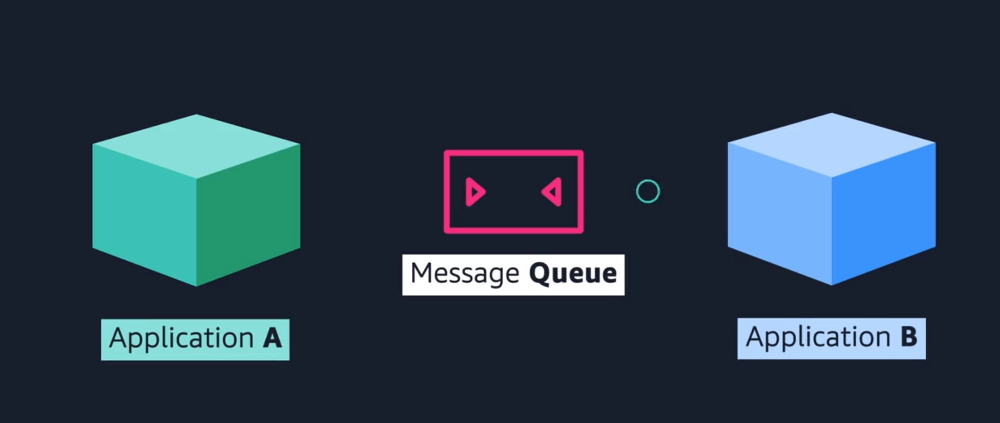
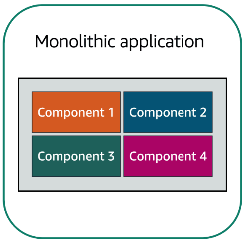
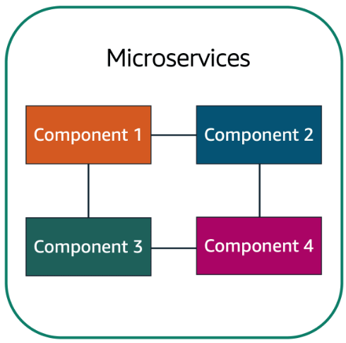
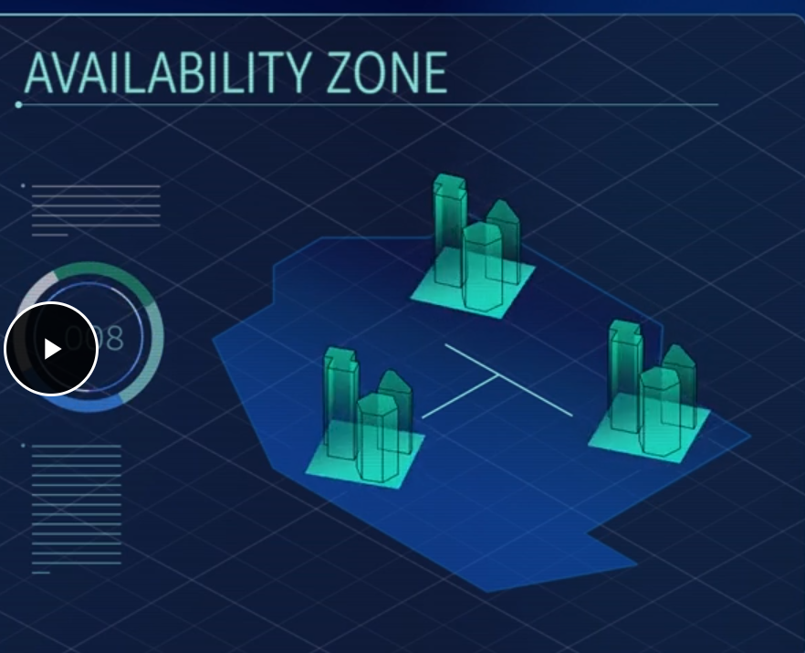
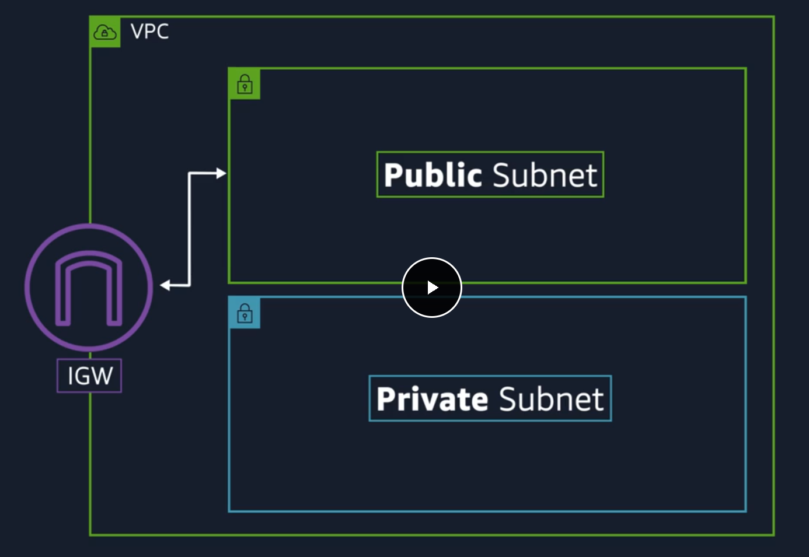

# AWS Cloud Practitioner Essentials Introduction

- EC2 Works for Server side
> EC2 is Elastic Cloud Compute, an AWS Service

Pay-as-you-go / Pay-for-use: paying just for the resources that you gonna use

Cloud computing: The on-demand delivery of IT Resources over the internet with a pay-as-you-go pricing.
> El objetivo de los cloud services es ofrecer toda la infraestructura de IT para que tú únicamente centres tu negocio en los contenidos que se hacen dentro de esa infraestructura pagando únicamente por los recursos que utilizas en el momento exacto en que los utilizas.

—
# Compute in the cloud

## Introduction to Amazon EC2

EC2 are virtual servers managed by Amazon, you can enter your request of the number of resources that you need instead of having a physical server running 24/7.

- Hypervisor: el software encargado de compartir o aislar los recursos entre VMs. Coordina el multitenancy.
- Multitenancy: Sharing underlying hardware between virtual machines.

Las instancias son seguras, ya que no se enteran entre ellas que existen, incluso si comparten recursos.

EC2 proporciona gran flexibilidad y control, también en la configuración de tus instancias.
- Puedes escoger el OS (Windows y Linux), que software quieres corriendo (programas de la empresa, web apps, databases, software de terceros, etc).
- Tienes completo control de qué corre en tu instance de EC2.

**Vertical Scaling**: que le puedas añadir más recursos a esa instancia en el momento que tú decidas. Incluso quitarle recursos.

- También puedes limitar los recursos de red de la instancia.

### Inconvenientes de usar On-premises servers

- Spend money upfront to purchase hardware.
- Wait for the servers to be delivered to you.
- Install the servers in your physical data center.
- Make all the necessary configurations.

### Ventajas de usar EC2

- You can provision and launch an Amazon EC2 instance within minutes.
- You can stop using it when you have finished running a workload.
- You pay only for the compute time you use when an instance is running, not when it is stopped or terminated.
- You can save costs by paying only for server capacity that you need or want.

### Cómo funciona EC2

- **Launch**: Lanzas una instancia, escogiendo una plantilla con configuraciones predenterminadas con componentes básicos, como el OS, las aplicaciones que va a llevar instaladas, el tipo de uso que se le va a usar, etc. También puedes escoger el *instance type* que hace referencia a la configuración de hardware que va a llevar el instance de EC2. Y también se puede especificar la configuración de seguridad y el tráfico de red que fluye en dicha instancia.
- **Connect**: Conectarse a la instancia, te puedes conectar a ella de diferentes formas, ya que esta cuenta con aplicaciones y configuraciones para conectarse e intercambiar datos. Los usuarios también pueden conectarse directamente loggeándose y accesando al escritorio.
- **Use**: Después de conectarse a la instancia, puedes empezar a usarla. Puedes correr comandos para instalar software, añadir almacenamiento, copiar y organizar archivos, etc etc.

---

### Amazon EC2 Instance types

Each EC2 instance type is grouped under an instance family. Cada una especializada en una tarea en concreto.
Cada tipo tiene una configuración distinta de CPU, RAM, almacenamiento y capacidades de red, dándote la capacidad específica para tus aplicaciones.

Las distintas familias de instances son:

- General purpose
1. Balanced resources
2. Diverse workloads (web servers or code repositories)
3. Small and medium databases

- Compute optimized
1. Compute intensive tasks (Gaming servers, High performance computing or scientific modeling)
2. Ideal for compute bound applications that benefit from high performance processors.
3. Batch processing workloads
4. Media transcoding 
5. High performance web servers
6. High performance computing (HPC)
7. Scientific modeling
8. Dedicated gaming servers and ad server engines
9. Machine learning inference and other compute intensive applications.

- Memory optimized
1. Memory intensive tasks
2. Databases
3. Carga de trabajo que implique mucho uso de memoria ram

- Accelerated computing
1. Floating point number calculations
2. Graphics processing
3. Data pattern matching
4. Utilize hardware accelerators
5. Streaming de videojuegos y películas

- Storage optimized
1. High performance for locally storaged data
2. Read and write secuential data
3. Data warehousing applications (aplicaciones de almacenamiento de datos)
4. Distribución de datos
5. High-frecuencly Online Transaction Processing (OLTP) systems
6. **IOPS**: término para input/output operations per second, métrica que mide el rendimiento de un dispositivo de almacenamiento.

—

### Amazon EC2 Pricing

Para EC2 hay dos principales modos de cobro y presupuesto para EC2:

1. On-Demand: solo pagas por la duración del uso de tu instancia, por hora o segundo y variando del OS que usas. No necesitas hablar con Amazon para comenzar a usarlo. Puedes usarlo como una vara con la que medir tus costes.
    * Ideales para uso corto, carga de trabajo irregular y que no se puede interrumpir,
    * No te cobran por adelantado ni te piden un contrato mínimo.
    * Estas instancias corren continuamente hasta que las detengas y solo pagas por el tiempo que la utilizaste.
    * ==ES COMO IR AL CIBER==
2. Savings plan: ofrece un precio todavía más bajo que el On-Demand pero limitado a solo un determinado uso, se mide en dólares/hora. Este tipo de presupuesto te puede ahorrar más del 70% del dinero estimado a gastar en AWS. Se paga en contratos de 1 a 3 años.
3. Reserved instances: específica para cargas de trabajo estables (steady-state workloads) o para aquellas con un uso predecible. Te puede ofrecer un descuento de hasta 75% comparado al on-demand. Se paga en contratos de 1 a 3 años con 3 opciones de pago:
    - All upfront: pagas todo de una en cuanto contratas.
    - Partial upfront: pagas una fracción al contratar.
    - No upfront: no pagas nada al contratar.
4. Spot instances: te permite solicitar poder de cómputo adicional de tu instancia de EC2, por hasta un 90% menos de precio que el On-Demand. El problema es que Amazon te puede decir "ya vete del ciber" cuando se le dé la gana y te va a avisar 2 minutos antes que dejes la compu y guardes lo que estás haciendo para continuar después. Esta es buena opción para cargas de trabajo que puedan ser interrumpidas.
5. Dedicated host: un server físico dedicado solo para tu uso de EC2. Son para usos muy muy específicos y nadie más que tú va a utilizar los recursos de ese server/host.

—

### Scaling Amazon EC2

Escalabilidad y Flexibilidad, cómo puedes hacer que la capacidad de tus centros de datos se adapten a tus necesidades basado en tus horas o periodos de tiempo de uso.
Las empresas que contratan o usan On-Demand no tienen forma de adaptar su capacidad al uso, debido a que siempre están págando por el 100% del hardware, aún cuando muchas veces no usen ni el 10% de todo su poder.
AWS permite utilizar los recursos para mantener el servicio activo, corriendo y adaptable sin puntos de falla.
Amazon EC2 tiene una función llamada **EC2 Auto Scaling** para satisfacer esa necesidad.

Within Amazon EC2 Auto Scaling, you can use two approaches: dynamic scaling and predictive scaling.

* _Dynamic scaling_ responds to changing demand. 
* _Predictive scaling _automatically schedules the right number of Amazon EC2 instances based on predicted demand.

**Tipos de escalabilidad**

- Vertical or scale up: meterle más recursos a la máquina que está corriendo el servicio. (Por sentido común sería lo óptimo, pero la mejor forma de verlo es imaginar una cafetería, con un cajero muy chingón pero que tiene que atender a un cliente bien wey teniendo una fila enorme de clientes esperando).
- Horizontal: añadir más computadoras para atender la carga de trabajo. Deja de ser óptimo cuando hay pocos clientes.

La ventaja que ofrece AWS es que permite tener el número correcto de instancias en el momento que los necesitas, de modo que las utilices del modo más eficiente.

**Concepto del Auto Scaling Group de EC2**

Puedes crear tu Auto Scaling Group, en el que estableces un mínimo, un deseado, y una capacidad máxima de instancias de EC2 que van a correr de acuerdo a la demanda de usuarios.
El mínimo son las instancias que van a iniciar nadamás encender el auto scaling group.
El desired van a correr en cuanto se superen las capacidades del minimo.
Y maximo solo durante picos de demanda.

## Directing Traffic with Elastic Load Balancing

Volvemos al ejemplo de la cafetería, supongamos que la gente está pendeja y todos se van a ser atendidos con el mismo cajero, dejando a los demás sin hacer nada. El problema es resuelto poniendo a alguien en la entrada a que cuente cuántas personas está atendiendo cada cajero para que los reparta de modo que sea eficiente.

A esto se le conoce en computación como un Load Balancer, debido a que todas las instancias deberían de ser capaces de correr lo mismo con la misma eficiencia. AWS ofrece varias soluciones para ello.

Tener un tráfico adecuado permite tener alto rendimiento, mayor eficiencia de costos, alta disponibilidad y escalamiento auitomático.

**Elastic Load Blancing** ELB, es uno de los que vamos a aprender. 
Regional construct, corre a nivel región, de modo que siempre está disponible. 
Es escalable, aumenta su capacidad conforme al número de demanda de usuarios.
ELB permite solicitar más y menos instancias de acuerdo a la demanda.
Funciona como un "puente" entre el frontend y el backend, en el que manda de forma ordenada las solicitudes al backend, y se entera de las capacidades del backend para distribuir mejor el tráfico de red. ESTO EVITA QUE CUANDO UNA INSTANCIA NUEVA SE ENCIENDA, NO SE TENGA QUE MANDAR ESA INFORMACIÓN AL FRONTEND, SOLAMENTE EL LOAD BALANCER SE ENTERA. El front end solamente se encarga de mandar solicitudes, no le importa quién las procese,

—

##  Messaging and Queuing

Ejemplo de la cafetería: la cajera toma la orden, la anota en papel y se la pasa al wey que prepara el café, este proceso se repite en cada petición del cliente.
Para evitar una situación en la que no se puedan entregar las órdenes, se crea un buffer, de modo que siempre se puedan recibir órdenes nuevas y el wey que prepara el café tenga tiempo de ver qué tiene pendiente.
== A ESTO SE LE LLAMA MESSAGING AND QUEUING==

- **Tightly coupled architecture**: Cuando no se tiene un buffer, puede causar fallas para todo el sistema.
- **Loosely coupled architecture**: Si un componente falla, no compromete al resto del sistema, Las fallas se quedan aisladas.

**En el Tightly no existe el message queue y se pierden todos los requests ya que no se almacenaron en un buffer**

El servicio de AWS que sirve para esto es Amazon Simple Queue Service (Amazon SQS) y Amazon Simple Notification Service (Amazon SNS)

—

## Apps monolíticas y microservicios

**Aplicación monolítica**: Applications are made of multiple components. The components communicate with each other to transmit data, fulfill requests, and keep the application running. 

Suppose that you have an application with tightly coupled components. These components might include databases, servers, the user interface, business logic, and so on. This type of architecture can be considered a **monolithic application**. 

In this approach to application architecture, if a single component fails, other components fail, and possibly the entire application fails.

> To help maintain application availability when a single component fails, you can design your application through a **microservices** approach.

**Microservicios**: In a microservices approach, application components are loosely coupled. In this case, if a single component fails, the other components continue to work because they are communicating with each other. The loose coupling prevents the entire application from failing. 

When designing applications on AWS, you can take a microservices approach with services and components that fulfill different functions. Two services facilitate application integration: Amazon Simple Notification Service (Amazon SNS) and Amazon Simple Queue Service (Amazon SQS).

—

### Amazon SNS

**Amazon Simple Notification Service (Amazon SNS)** is a publish/subscribe service. Using Amazon SNS topics, a publisher publishes messages to subscribers. This is similar to the coffee shop; the cashier provides coffee orders to the barista who makes the drinks.

In Amazon SNS, subscribers can be web servers, email addresses, AWS Lambda functions, or several other options.

Por ejemplo, supongamos que en una cafetería mandas correos con trivias de café, descuentos y noticias a todos tus clientes pero has notado que algunos solo están interesados en un tipo de correos. SNS te permite dividir en categorías para que tus usuarios se suscriban únicamente al canal del que desean recibir estas notificaciones.

—

### Amazon SQS

Este nos permite:

- Send messages
- Store messages
- Receive messages
- Between software components and at any volume

Sin perder mensajes o requerir que otro servicio esté disponible

**Payload**: Los datos que contiene un mensaje, se quedan protegidos hasta su entrega.

**Amazon SQS queues**: donde los mensajes se quedan alojados hasta que sean procesados.

También puede notificar al usuario del estatus de sus mensajes,

**Amazon SNS topic***: Un canal para los mensajes a entregar. Se envía un mensaje en específico a todos los suscriptores de dicho canal en un solo envío. Estos mensajes pueden ser también a otros servicios de AWS así como usuarios.

—

## Additional Compute Services (Lambda, Containers, Kubernetes & Fargate)

- En EC2 tú eres el responsable de actualizar el software que utilizas, manejar las instancias y subir tu código

**Serverless**: Que no puedes ver o accesar la infraestructura subyacente o las instancias que están corriendo tu aplicación. Tú no te preocupas por la configración, actualizaciones ni nada referente al sistema, solo en hacer y correr tu aplicación.

**AWS Lambda**: Tú subes tu código, configuras el trigger y esta corre en cuanto se activa el trigger. Lambda se encarga por sí solo de instalar las dependencias y de escalarse si es necesario. Solamente pagas cuando tu código corre, todo bajo cero administración.

**Containers**: provide you with a standard way to package your application's code and dependencies into a single object. You can also use containers for processes and workflows in which there are essential requirements for security, reliability, and scalability.

**AWS Elastic Container Service(ECS)**: is a highly scalable, high-performance container management system that enables you to run and scale containerized applications on AWS. 
Amazon ECS supports Docker containers.

**AWS Elastic Kubernetes Service (EKS)**: is a fully managed service that you can use to run Kubernetes on AWS. 
Kubernetes is open-source software that enables you to deploy and manage containerized applications at scale. A large community of volunteers maintains Kubernetes, and AWS actively works together with the Kubernetes community. As new features and functionalities release for Kubernetes applications, you can easily apply these updates to your applications managed by Amazon EKS.

**AWS Fargate**: is a serverless compute engine for containers. It works with both Amazon ECS and Amazon EKS. 
When using AWS Fargate, you do not need to provision or manage servers. AWS Fargate manages your server infrastructure for you. You can focus more on innovating and developing your applications, and you pay only for the resources that are required to run your containers.

—

# Global Infrastructure and Reliability

## Introduction

Aquí vamos a aprender:

- Beneficios de la infraestructura global de AWS
- Describir los conceptos básicos de Availability Zones
- Describir los beneficios de Amazon CloudFront y ubicaciones de bordes (edge locations)
- Comparar los distintos métodos de proveer los servicios de AWS

Para entender el concepto de disponibilidad supongamos que por alguna razón, los clientes no pueden ir a la cafetería que antes mencionamos, sin embargo, la cafetería es parte de una franquicia, de modo que si no pueden ir a una de ellas, van a otra que si esté disponible.

—

## AWS Global Infrastructure

Prevenir desastres, todos los datacenters sin importar quién o cómo los hizo son propensos a cualquier tipo de desastre, esto podría prevenirse haciendo un segundo datacenter pero esto implica un incremento enorme de costos.

—

### Regions

AWS tiene un chingo de servidores y datacenters repartidos por el mundo, que pueden acceder rápidamente entre ellos mediante conexiones de fibra óptica manejadas por AWS.
Cuando contratas AWS tienes que elegir en qué region van a correr tus datos, porque no se mueven entre regiones, a menos que pidas explícitamente que muevan tus datos.

Hay 4 parámetros para escoger una región:

1. Compliance (cumplimiento/conformidad/obediencia) with data governance and legal requirements: Antes que cualquier otro factor, toma en cuenta las cosas que debes cumplir, por ejemplo que tus datos deban estar en X país. También tomar en cuenta si el país donde estás alojando tus datos no tiene alguna ley que limite el funcionamiento de tu página.
2. Proximity: qué tan cerca estás de tus clientes, si por ejemplo la mayoría de tus clientes viven en Singapur, te conviene poner tus servicios en la región de Singapur para reducir la latencia.
3. Feature availability: hay algunas regiones que no cuentan con las últimas características y servicios. Por ejemplo, Amazon Braket el nuevo servicio de computación cuántica.
4. Pricing: pese a que todo el hardware es prácticamente el mismo, hay zonas en las que ciertos factores varían el precio, por ejemplo Sao Paulo en Brasil por sus pedos con los extranjeros.

—

### Availability Zones (AZ)

Volviendo al problema planteado al inicio del bloque, lo seguimos teniendo porque seguimos corriendo nuestras apps y servicios en un solo "server"/region.
AWS tiene varios data centers en cada región, cada región está hecha de varios data centers, AWS le llama a uno o varios data centers como "availability zones" (AZ).

La forma que tiene AWS de evitar o mitigar desastres naturales es separar su AZ una de otra lo más posible para que el mismo servicio esté corriendo en varios edificios, si uno falla, los demás pueden tomar esa carga de trabajo.

Puedes prevenir estos problemas, por ejemplo corriendo dos instancias de EC2 en dos AZ distintas.

Los regionally scoped service, corren sin problemas en multiregión sin mayores costes adicionales.

—

### Edge Locations

Si tu organización tiene clientes en todo el mundo y no es posible que la region esté cerca de todos puedes hacer una "sucursal" como en el ejemplo de la cafetería.

An **edge location** is a site that Amazon CloudFront uses to store cached copies of your content closer to your customers for faster delivery.

* **Content Delivery Network (CDN)**: Se les conoce como Amazon Cloudfront
* **Amazon Cloudfront**: usa Edge Locations, separados de las regiones específicamente solo para entregar contenidos con gran velocidad.
* **Amazon Route 53**: Contiene DNS para redirigir a los clientes y obtener latencia baja.
* **AWS Outposts**: Si un cliente quiere que AWS corra en sus propias instalaciones físicas, se utiliza este servicio en el que AWS va a instalar una mini región aislada a tu edificio.

—

### How to Provision AWS Resources

La forma de comunicarse con AWS y sus recursos siempre va a ser mediante APIs

**API**: Application programming interface, una forma predeterminada de interactuar con tus recursos de AWS (crear, borrar, iniciar mover, etc).
Hay varias formas de interactuar mediante el uso de la API como:
- AWS Management Console: basada en el navegador, de forma visual y fácil de digerir. Recomendada para principiantes. Se recomienda usarla para: Test environments, ver las facturas y cobros, monitorear y trabajar con recursos no técnicos. Deja de ser óptima cuando te mueves a un ambiente de producción en la que el point and click no sea eficiente.
- AWS Command Line Interface (CLI): hace llamadas a la API desde la consola de tu computadora. Puedes scriptear para hacer procesos automáticamente y reduciendo el margen de error muy considerablemente.
- AWS Software Development Kits (SDKs): Interactuar con AWS mediante algún lenguaje de programación, ideal para programadores. To help you get started with using SDKs, AWS provides documentation and sample code for each supported programming language. Supported programming languages include C++, Java, .NET, and more.
- Other tools (CloudFormation)

Además de las antes mencionadas, AWS provee de otras formas de interactuar con los servicios como:

**AWS Elastic Beanstalk**: servicio que te ayuda a crear environments de EC2. Le das el código de tu aplicación, las configuraciones deseadas y las va a hacer para tí. Te da las facilidades de no tener que manejar todo esto de forma separada, ya que lo puede replicar sin problemas.
With **AWS Elastic Beanstalk**, you provide code and configuration settings, and Elastic Beanstalk deploys the resources necessary to perform the following tasks:

* Adjust capacity
* Load balancing
* Automatic scaling
* Application health monitoring
* 

**AWS CloudFormation**: Infrastructure as code tool used to define a wide variety of AWS resources. Se ocupa de los comandos por sí sola y maneja:
- Storage
- Databases
- Analytics
- Machine Learning

Puedes tomar un template para que por sí sola haga las calls a la API e incluso pueda correr esa template en otra cuenta para automatizar el proceso.

With **AWS CloudFormation**, you can treat your infrastructure as code. This means that you can build an environment by writing lines of code instead of using the AWS Management Console to individually provision resources.

AWS CloudFormation provisions your resources in a safe, repeatable manner, enabling you to frequently build your infrastructure and applications without having to perform manual actions. It determines the right operations to perform when managing your stack and rolls back changes automatically if it detects errors.

— 

# Networking

Vamos a aprender:

* Describe the basic concepts of networking.
* Describe the difference between public and private networking resources. 
* Explain a virtual private gateway using a real life scenario. 
* Explain a virtual private network (VPN) using a real life scenario.
* Describe the benefit of AWS Direct Connect. 
* Describe the benefit of hybrid deployments. 
* Describe the layers of security used in an IT strategy.
* Describe the services customers use to interact with the AWS global network.

Volviendo al ejemplo de cafetería, imaginemos que hay gente que quiere pedirle las cosas directo al wey que prepara el café en lugar de al cajero. No tiene sentido porque ese bato debe estar concentrado haciendo café.

**Amazon Virtual Private Cloud (Amazon VPC)**: Nos da una sección de red completamente aislada para los servicios de AWS Cloud, se puede definir qué servicios pueden ser públicos o privados a internet.

—

## Connectivity to AWS

**Virtual Private Cloud (VPC)**: es en esencia nuestra red privada, permite definir el rango de IPs privadas.

**Subnets**: control resources

**Public traffic**:

**Internet Gateway (IGW)**: una "puerta" donde puede acceder todo el mundo, incluido el tráfico público, como la entrada principal de una cafetería.

**Virtual Private Gateway**: puerta que solo permitirá entrar a ciertos usuarios conectados a una red, puede ser mediante una VPN corporativa. *Ejemplo: imaginemos que mi empresa tiene transporte directo a la cafetería, y para acceder a ella debo autenticarme*.
Sigue contando con la desventaja de seguir corriendo sobre el internet público y dependiendo del ancho de banda del internet. AWS lo soluciona con una conexión dedicada a los recursos.

### AWS Direct Connect

Permite establecer una conexión de fibra óptica privada y dedicada desde tu datacenter a AWS. Es una conexión física real y elimina los problemas de ancho de banda.

—

## Subnets and Network Access Control Lists

Imaginemos a la VPC como una fortaleza en donde nada entra o sale sin estricto control. Pero eso solo cubre el perímetro.

AWS tiene varias herramientas para cubrir varios aspectos de la seguridad:

* Network hardening
* Application security
* User identity
* Authentication and authorization
* Distributed denial of service prevention
* Data integrity
* Encryption

La única razón para tener subnets dentro de una VPC es para controlar el acceso a la IGW de la VPC, Las Public subnets SI TIENEN acceso  a la IGW, las Private subnets NO TIENEN ACCESO.

Las subnets también pueden controlar el tráfico de red.
**Packets**: mensajes de internet.
Cada packet que quiera acceder a la subnet, tiene que pasar por una **Network access control list** (Network ACL) el cual checa si tiene permisos para entrar o salir dependiendo de su información, contenido, quién lo envió, etc.
Se pueden imaginar visualmente como un oficial de migración que revisa tu pasaporte.
Sin embargo, ESTO NO GARANTIZA TOTAL SEGURIDAD, es solo una capa más.

Las instancias de EC2 dentro de una subnet a su vez, forman parte de un Security Group que se crea nadamás lanzar la instancia. POR DEFAULT LAS INSTANCIAS NO PERMITEN NINGUNA CLASE DE COMUNICACIÓN, ES MUY SEGURO PERO NO ES MUY USABLE.
Esto es configurable, por ejemplo, puedes solo admitir tráfico de determinada página web y rechazar cualquier cosa que pida credenciales de administrador.

**DIFERENCIA ENTRE UN SECURITY GROUP Y UN NETWORK ACL**

El security group es Stateful, lo que significa que va a almacenar en memoria lo que debe admitir o no, como una lista.
El network ACL es Stateless, lo que se traduce en que sin importar las circunstancias, siempre va a revisar el contenido de los packages recibidos.

El security group es como un guardia en la entrada al que le dices "ahorita regreso" mientras que el network ACL es más como el wey de migración que siempre checa si puedes entrar o no al gabacho.

—

## Global networking

