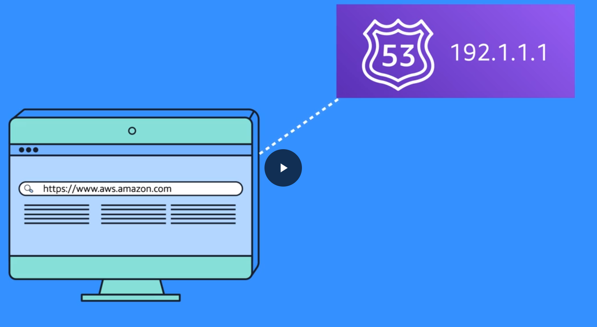
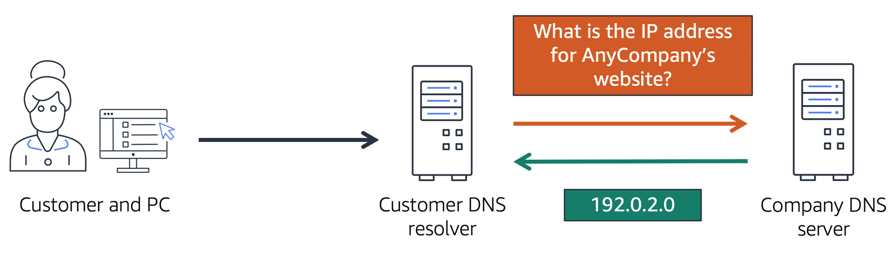
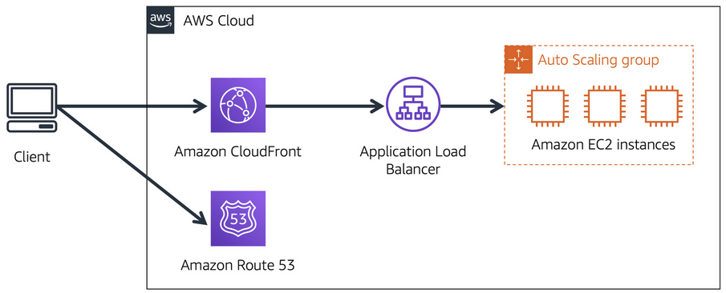
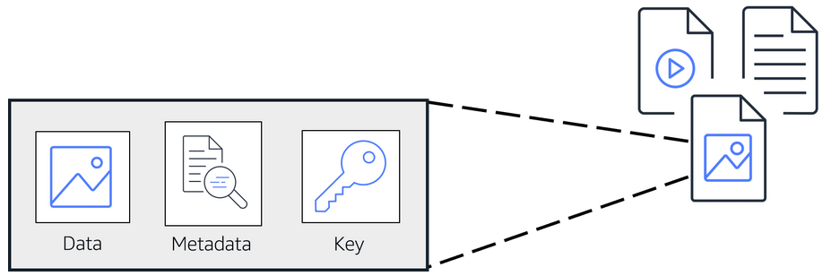
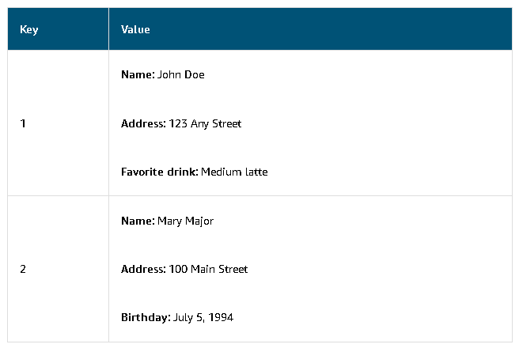
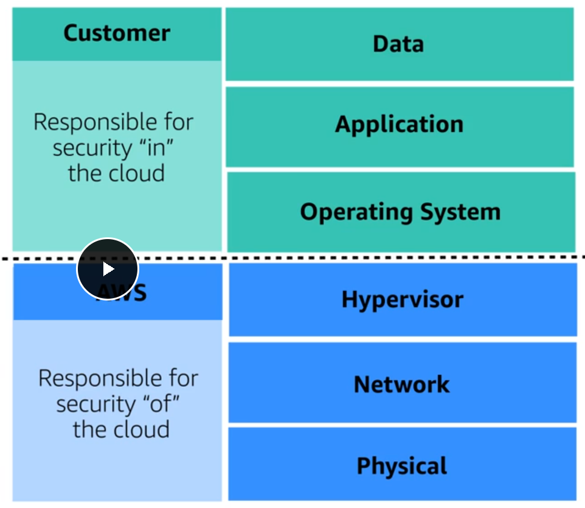
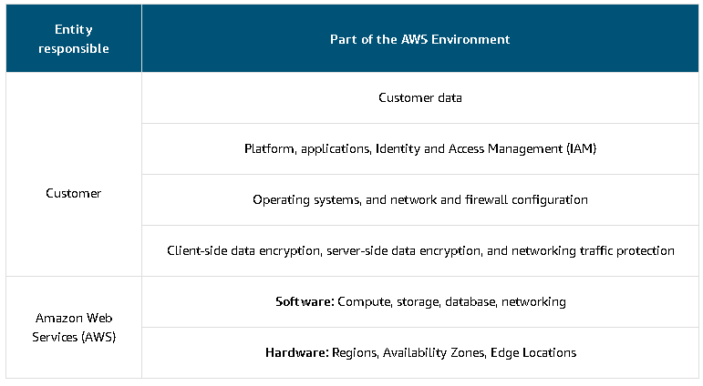
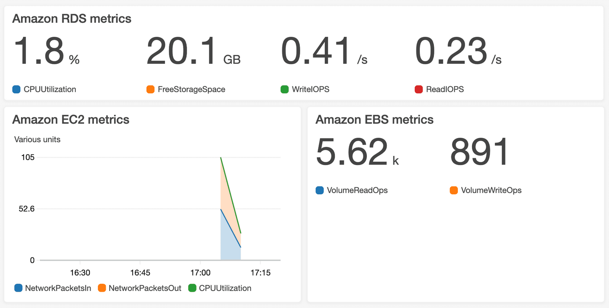
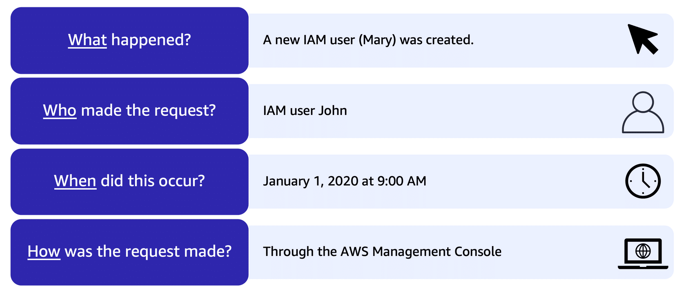
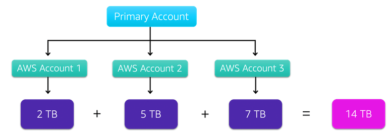

# AWS Cloud Practitioner Essentials Introduction

- EC2 Works for Server side
  
  > EC2 is Elastic Cloud Compute, an AWS Service

Pay-as-you-go / Pay-for-use: paying just for the resources that you gonna use

Cloud computing: The on-demand delivery of IT Resources over the internet with a pay-as-you-go pricing.

> El objetivo de los cloud services es ofrecer toda la infraestructura de IT para que tú únicamente centres tu negocio en los contenidos que se hacen dentro de esa infraestructura pagando únicamente por los recursos que utilizas en el momento exacto en que los utilizas.

—

# Compute in the cloud

## Introduction to Amazon EC2

EC2 are virtual servers managed by Amazon, you can enter your request of the number of resources that you need instead of having a physical server running 24/7.

- Hypervisor: el software encargado de compartir o aislar los recursos entre VMs. Coordina el multitenancy.
- Multitenancy: Sharing underlying hardware between virtual machines.

Las instancias son seguras, ya que no se enteran entre ellas que existen, incluso si comparten recursos.

EC2 proporciona gran flexibilidad y control, también en la configuración de tus instancias.

- Puedes escoger el OS (Windows y Linux), que software quieres corriendo (programas de la empresa, web apps, databases, software de terceros, etc).
- Tienes completo control de qué corre en tu instance de EC2.

**Vertical Scaling**: que le puedas añadir más recursos a esa instancia en el momento que tú decidas. Incluso quitarle recursos.

- También puedes limitar los recursos de red de la instancia.

### Inconvenientes de usar On-premises servers

- Spend money upfront to purchase hardware.
- Wait for the servers to be delivered to you.
- Install the servers in your physical data center.
- Make all the necessary configurations.

### Ventajas de usar EC2

- You can provision and launch an Amazon EC2 instance within minutes.
- You can stop using it when you have finished running a workload.
- You pay only for the compute time you use when an instance is running, not when it is stopped or terminated.
- You can save costs by paying only for server capacity that you need or want.

### Cómo funciona EC2

- **Launch**: Lanzas una instancia, escogiendo una plantilla con configuraciones predenterminadas con componentes básicos, como el OS, las aplicaciones que va a llevar instaladas, el tipo de uso que se le va a usar, etc. También puedes escoger el *instance type* que hace referencia a la configuración de hardware que va a llevar el instance de EC2. Y también se puede especificar la configuración de seguridad y el tráfico de red que fluye en dicha instancia.
- **Connect**: Conectarse a la instancia, te puedes conectar a ella de diferentes formas, ya que esta cuenta con aplicaciones y configuraciones para conectarse e intercambiar datos. Los usuarios también pueden conectarse directamente loggeándose y accesando al escritorio.
- **Use**: Después de conectarse a la instancia, puedes empezar a usarla. Puedes correr comandos para instalar software, añadir almacenamiento, copiar y organizar archivos, etc etc.

---

### Amazon EC2 Instance types

Each EC2 instance type is grouped under an instance family. Cada una especializada en una tarea en concreto.
Cada tipo tiene una configuración distinta de CPU, RAM, almacenamiento y capacidades de red, dándote la capacidad específica para tus aplicaciones.

Las distintas familias de instances son:

- General purpose
1. Balanced resources
2. Diverse workloads (web servers or code repositories)
3. Small and medium databases
- Compute optimized
1. Compute intensive tasks (Gaming servers, High performance computing or scientific modeling)
2. Ideal for compute bound applications that benefit from high performance processors.
3. Batch processing workloads
4. Media transcoding 
5. High performance web servers
6. High performance computing (HPC)
7. Scientific modeling
8. Dedicated gaming servers and ad server engines
9. Machine learning inference and other compute intensive applications.
- Memory optimized
1. Memory intensive tasks
2. Databases
3. Carga de trabajo que implique mucho uso de memoria ram
- Accelerated computing
1. Floating point number calculations
2. Graphics processing
3. Data pattern matching
4. Utilize hardware accelerators
5. Streaming de videojuegos y películas
- Storage optimized
1. High performance for locally storaged data
2. Read and write secuential data
3. Data warehousing applications (aplicaciones de almacenamiento de datos)
4. Distribución de datos
5. High-frecuencly Online Transaction Processing (OLTP) systems
6. **IOPS**: término para input/output operations per second, métrica que mide el rendimiento de un dispositivo de almacenamiento.

—

### Amazon EC2 Pricing

Para EC2 hay dos principales modos de cobro y presupuesto para EC2:

1. On-Demand: solo pagas por la duración del uso de tu instancia, por hora o segundo y variando del OS que usas. No necesitas hablar con Amazon para comenzar a usarlo. Puedes usarlo como una vara con la que medir tus costes.
   * Ideales para uso corto, carga de trabajo irregular y que no se puede interrumpir,
   * No te cobran por adelantado ni te piden un contrato mínimo.
   * Estas instancias corren continuamente hasta que las detengas y solo pagas por el tiempo que la utilizaste.
   * ==ES COMO IR AL CIBER==
2. Savings plan: ofrece un precio todavía más bajo que el On-Demand pero limitado a solo un determinado uso, se mide en dólares/hora. Este tipo de presupuesto te puede ahorrar más del 70% del dinero estimado a gastar en AWS. Se paga en contratos de 1 a 3 años.
3. Reserved instances: específica para cargas de trabajo estables (steady-state workloads) o para aquellas con un uso predecible. Te puede ofrecer un descuento de hasta 75% comparado al on-demand. Se paga en contratos de 1 a 3 años con 3 opciones de pago:
   - All upfront: pagas todo de una en cuanto contratas.
   - Partial upfront: pagas una fracción al contratar.
   - No upfront: no pagas nada al contratar.
4. Spot instances: te permite solicitar poder de cómputo adicional de tu instancia de EC2, por hasta un 90% menos de precio que el On-Demand. El problema es que Amazon te puede decir "ya vete del ciber" cuando se le dé la gana y te va a avisar 2 minutos antes que dejes la compu y guardes lo que estás haciendo para continuar después. Esta es buena opción para cargas de trabajo que puedan ser interrumpidas.
5. Dedicated host: un server físico dedicado solo para tu uso de EC2. Son para usos muy muy específicos y nadie más que tú va a utilizar los recursos de ese server/host.

—

### Scaling Amazon EC2

Escalabilidad y Flexibilidad, cómo puedes hacer que la capacidad de tus centros de datos se adapten a tus necesidades basado en tus horas o periodos de tiempo de uso.
Las empresas que contratan o usan On-Demand no tienen forma de adaptar su capacidad al uso, debido a que siempre están págando por el 100% del hardware, aún cuando muchas veces no usen ni el 10% de todo su poder.
AWS permite utilizar los recursos para mantener el servicio activo, corriendo y adaptable sin puntos de falla.
Amazon EC2 tiene una función llamada **EC2 Auto Scaling** para satisfacer esa necesidad.

Within Amazon EC2 Auto Scaling, you can use two approaches: dynamic scaling and predictive scaling.

* _Dynamic scaling_ responds to changing demand. 
* _Predictive scaling _automatically schedules the right number of Amazon EC2 instances based on predicted demand.

**Tipos de escalabilidad**

- Vertical or scale up: meterle más recursos a la máquina que está corriendo el servicio. (Por sentido común sería lo óptimo, pero la mejor forma de verlo es imaginar una cafetería, con un cajero muy chingón pero que tiene que atender a un cliente bien wey teniendo una fila enorme de clientes esperando).
- Horizontal: añadir más computadoras para atender la carga de trabajo. Deja de ser óptimo cuando hay pocos clientes.

La ventaja que ofrece AWS es que permite tener el número correcto de instancias en el momento que los necesitas, de modo que las utilices del modo más eficiente.

**Concepto del Auto Scaling Group de EC2**

Puedes crear tu Auto Scaling Group, en el que estableces un mínimo, un deseado, y una capacidad máxima de instancias de EC2 que van a correr de acuerdo a la demanda de usuarios.
El mínimo son las instancias que van a iniciar nadamás encender el auto scaling group.
El desired van a correr en cuanto se superen las capacidades del minimo.
Y maximo solo durante picos de demanda.

## Directing Traffic with Elastic Load Balancing

Volvemos al ejemplo de la cafetería, supongamos que la gente está pendeja y todos se van a ser atendidos con el mismo cajero, dejando a los demás sin hacer nada. El problema es resuelto poniendo a alguien en la entrada a que cuente cuántas personas está atendiendo cada cajero para que los reparta de modo que sea eficiente.

A esto se le conoce en computación como un Load Balancer, debido a que todas las instancias deberían de ser capaces de correr lo mismo con la misma eficiencia. AWS ofrece varias soluciones para ello.

Tener un tráfico adecuado permite tener alto rendimiento, mayor eficiencia de costos, alta disponibilidad y escalamiento auitomático.

**Elastic Load Blancing** ELB, es uno de los que vamos a aprender. 
Regional construct, corre a nivel región, de modo que siempre está disponible. 
Es escalable, aumenta su capacidad conforme al número de demanda de usuarios.
ELB permite solicitar más y menos instancias de acuerdo a la demanda.
Funciona como un "puente" entre el frontend y el backend, en el que manda de forma ordenada las solicitudes al backend, y se entera de las capacidades del backend para distribuir mejor el tráfico de red. ESTO EVITA QUE CUANDO UNA INSTANCIA NUEVA SE ENCIENDA, NO SE TENGA QUE MANDAR ESA INFORMACIÓN AL FRONTEND, SOLAMENTE EL LOAD BALANCER SE ENTERA. El front end solamente se encarga de mandar solicitudes, no le importa quién las procese,

—

## Messaging and Queuing

Ejemplo de la cafetería: la cajera toma la orden, la anota en papel y se la pasa al wey que prepara el café, este proceso se repite en cada petición del cliente.
Para evitar una situación en la que no se puedan entregar las órdenes, se crea un buffer, de modo que siempre se puedan recibir órdenes nuevas y el wey que prepara el café tenga tiempo de ver qué tiene pendiente.
== A ESTO SE LE LLAMA MESSAGING AND QUEUING==

- **Tightly coupled architecture**: Cuando no se tiene un buffer, puede causar fallas para todo el sistema.
- **Loosely coupled architecture**: Si un componente falla, no compromete al resto del sistema, Las fallas se quedan aisladas.
  

**En el Tightly no existe el message queue y se pierden todos los requests ya que no se almacenaron en un buffer**

El servicio de AWS que sirve para esto es Amazon Simple Queue Service (Amazon SQS) y Amazon Simple Notification Service (Amazon SNS)

—

## Apps monolíticas y microservicios

**Aplicación monolítica**: Applications are made of multiple components. The components communicate with each other to transmit data, fulfill requests, and keep the application running. 

Suppose that you have an application with tightly coupled components. These components might include databases, servers, the user interface, business logic, and so on. This type of architecture can be considered a **monolithic application**. 

In this approach to application architecture, if a single component fails, other components fail, and possibly the entire application fails.

> To help maintain application availability when a single component fails, you can design your application through a **microservices** approach.

**Microservicios**: In a microservices approach, application components are loosely coupled. In this case, if a single component fails, the other components continue to work because they are communicating with each other. The loose coupling prevents the entire application from failing. 

When designing applications on AWS, you can take a microservices approach with services and components that fulfill different functions. Two services facilitate application integration: Amazon Simple Notification Service (Amazon SNS) and Amazon Simple Queue Service (Amazon SQS).

—

### Amazon SNS

**Amazon Simple Notification Service (Amazon SNS)** is a publish/subscribe service. Using Amazon SNS topics, a publisher publishes messages to subscribers. This is similar to the coffee shop; the cashier provides coffee orders to the barista who makes the drinks.

In Amazon SNS, subscribers can be web servers, email addresses, AWS Lambda functions, or several other options.

Por ejemplo, supongamos que en una cafetería mandas correos con trivias de café, descuentos y noticias a todos tus clientes pero has notado que algunos solo están interesados en un tipo de correos. SNS te permite dividir en categorías para que tus usuarios se suscriban únicamente al canal del que desean recibir estas notificaciones.

—

### Amazon SQS

Este nos permite:

- Send messages
- Store messages
- Receive messages
- Between software components and at any volume

Sin perder mensajes o requerir que otro servicio esté disponible

**Payload**: Los datos que contiene un mensaje, se quedan protegidos hasta su entrega.

**Amazon SQS queues**: donde los mensajes se quedan alojados hasta que sean procesados.

También puede notificar al usuario del estatus de sus mensajes,

**Amazon SNS topic***: Un canal para los mensajes a entregar. Se envía un mensaje en específico a todos los suscriptores de dicho canal en un solo envío. Estos mensajes pueden ser también a otros servicios de AWS así como usuarios.

—

## Additional Compute Services (Lambda, Containers, Kubernetes & Fargate)

- En EC2 tú eres el responsable de actualizar el software que utilizas, manejar las instancias y subir tu código

**Serverless**: Que no puedes ver o accesar la infraestructura subyacente o las instancias que están corriendo tu aplicación. Tú no te preocupas por la configración, actualizaciones ni nada referente al sistema, solo en hacer y correr tu aplicación.

**AWS Lambda**: Tú subes tu código, configuras el trigger y esta corre en cuanto se activa el trigger. Lambda se encarga por sí solo de instalar las dependencias y de escalarse si es necesario. Solamente pagas cuando tu código corre, todo bajo cero administración.

**Containers**: provide you with a standard way to package your application's code and dependencies into a single object. You can also use containers for processes and workflows in which there are essential requirements for security, reliability, and scalability.

**AWS Elastic Container Service(ECS)**: is a highly scalable, high-performance container management system that enables you to run and scale containerized applications on AWS. 
Amazon ECS supports Docker containers.

**AWS Elastic Kubernetes Service (EKS)**: is a fully managed service that you can use to run Kubernetes on AWS. 
Kubernetes is open-source software that enables you to deploy and manage containerized applications at scale. A large community of volunteers maintains Kubernetes, and AWS actively works together with the Kubernetes community. As new features and functionalities release for Kubernetes applications, you can easily apply these updates to your applications managed by Amazon EKS.

**AWS Fargate**: is a serverless compute engine for containers. It works with both Amazon ECS and Amazon EKS. 
When using AWS Fargate, you do not need to provision or manage servers. AWS Fargate manages your server infrastructure for you. You can focus more on innovating and developing your applications, and you pay only for the resources that are required to run your containers.

—

# Global Infrastructure and Reliability

## Introduction

Aquí vamos a aprender:

- Beneficios de la infraestructura global de AWS
- Describir los conceptos básicos de Availability Zones
- Describir los beneficios de Amazon CloudFront y ubicaciones de bordes (edge locations)
- Comparar los distintos métodos de proveer los servicios de AWS

Para entender el concepto de disponibilidad supongamos que por alguna razón, los clientes no pueden ir a la cafetería que antes mencionamos, sin embargo, la cafetería es parte de una franquicia, de modo que si no pueden ir a una de ellas, van a otra que si esté disponible.

—

## AWS Global Infrastructure

Prevenir desastres, todos los datacenters sin importar quién o cómo los hizo son propensos a cualquier tipo de desastre, esto podría prevenirse haciendo un segundo datacenter pero esto implica un incremento enorme de costos.

—

### Regions

AWS tiene un chingo de servidores y datacenters repartidos por el mundo, que pueden acceder rápidamente entre ellos mediante conexiones de fibra óptica manejadas por AWS.
Cuando contratas AWS tienes que elegir en qué region van a correr tus datos, porque no se mueven entre regiones, a menos que pidas explícitamente que muevan tus datos.

Hay 4 parámetros para escoger una región:

1. Compliance (cumplimiento/conformidad/obediencia) with data governance and legal requirements: Antes que cualquier otro factor, toma en cuenta las cosas que debes cumplir, por ejemplo que tus datos deban estar en X país. También tomar en cuenta si el país donde estás alojando tus datos no tiene alguna ley que limite el funcionamiento de tu página.
2. Proximity: qué tan cerca estás de tus clientes, si por ejemplo la mayoría de tus clientes viven en Singapur, te conviene poner tus servicios en la región de Singapur para reducir la latencia.
3. Feature availability: hay algunas regiones que no cuentan con las últimas características y servicios. Por ejemplo, Amazon Braket el nuevo servicio de computación cuántica.
4. Pricing: pese a que todo el hardware es prácticamente el mismo, hay zonas en las que ciertos factores varían el precio, por ejemplo Sao Paulo en Brasil por sus pedos con los extranjeros.

—

### Availability Zones (AZ)

Volviendo al problema planteado al inicio del bloque, lo seguimos teniendo porque seguimos corriendo nuestras apps y servicios en un solo "server"/region.
AWS tiene varios data centers en cada región, cada región está hecha de varios data centers, AWS le llama a uno o varios data centers como "availability zones" (AZ).

La forma que tiene AWS de evitar o mitigar desastres naturales es separar su AZ una de otra lo más posible para que el mismo servicio esté corriendo en varios edificios, si uno falla, los demás pueden tomar esa carga de trabajo.

Puedes prevenir estos problemas, por ejemplo corriendo dos instancias de EC2 en dos AZ distintas.

Los regionally scoped service, corren sin problemas en multiregión sin mayores costes adicionales.

—

### Edge Locations

Si tu organización tiene clientes en todo el mundo y no es posible que la region esté cerca de todos puedes hacer una "sucursal" como en el ejemplo de la cafetería.

An **edge location** is a site that Amazon CloudFront uses to store cached copies of your content closer to your customers for faster delivery.

* **Content Delivery Network (CDN)**: Se les conoce como Amazon Cloudfront
* **Amazon Cloudfront**: usa Edge Locations, separados de las regiones específicamente solo para entregar contenidos con gran velocidad.
* **Amazon Route 53**: Contiene DNS para redirigir a los clientes y obtener latencia baja.
* **AWS Outposts**: Si un cliente quiere que AWS corra en sus propias instalaciones físicas, se utiliza este servicio en el que AWS va a instalar una mini región aislada a tu edificio.

—

### How to Provision AWS Resources

La forma de comunicarse con AWS y sus recursos siempre va a ser mediante APIs

**API**: Application programming interface, una forma predeterminada de interactuar con tus recursos de AWS (crear, borrar, iniciar mover, etc).
Hay varias formas de interactuar mediante el uso de la API como:

- AWS Management Console: basada en el navegador, de forma visual y fácil de digerir. Recomendada para principiantes. Se recomienda usarla para: Test environments, ver las facturas y cobros, monitorear y trabajar con recursos no técnicos. Deja de ser óptima cuando te mueves a un ambiente de producción en la que el point and click no sea eficiente.
- AWS Command Line Interface (CLI): hace llamadas a la API desde la consola de tu computadora. Puedes scriptear para hacer procesos automáticamente y reduciendo el margen de error muy considerablemente.
- AWS Software Development Kits (SDKs): Interactuar con AWS mediante algún lenguaje de programación, ideal para programadores. To help you get started with using SDKs, AWS provides documentation and sample code for each supported programming language. Supported programming languages include C++, Java, .NET, and more.
- Other tools (CloudFormation)

Además de las antes mencionadas, AWS provee de otras formas de interactuar con los servicios como:

**AWS Elastic Beanstalk**: servicio que te ayuda a crear environments de EC2. Le das el código de tu aplicación, las configuraciones deseadas y las va a hacer para tí. Te da las facilidades de no tener que manejar todo esto de forma separada, ya que lo puede replicar sin problemas.
With **AWS Elastic Beanstalk**, you provide code and configuration settings, and Elastic Beanstalk deploys the resources necessary to perform the following tasks:

* Adjust capacity
* Load balancing
* Automatic scaling
* Application health monitoring
* 

**AWS CloudFormation**: Infrastructure as code tool used to define a wide variety of AWS resources. Se ocupa de los comandos por sí sola y maneja:

- Storage
- Databases
- Analytics
- Machine Learning

Puedes tomar un template para que por sí sola haga las calls a la API e incluso pueda correr esa template en otra cuenta para automatizar el proceso.

With **AWS CloudFormation**, you can treat your infrastructure as code. This means that you can build an environment by writing lines of code instead of using the AWS Management Console to individually provision resources.

AWS CloudFormation provisions your resources in a safe, repeatable manner, enabling you to frequently build your infrastructure and applications without having to perform manual actions. It determines the right operations to perform when managing your stack and rolls back changes automatically if it detects errors.

— 

# Networking

Vamos a aprender:

* Describe the basic concepts of networking.
* Describe the difference between public and private networking resources. 
* Explain a virtual private gateway using a real life scenario. 
* Explain a virtual private network (VPN) using a real life scenario.
* Describe the benefit of AWS Direct Connect. 
* Describe the benefit of hybrid deployments. 
* Describe the layers of security used in an IT strategy.
* Describe the services customers use to interact with the AWS global network.

Volviendo al ejemplo de cafetería, imaginemos que hay gente que quiere pedirle las cosas directo al wey que prepara el café en lugar de al cajero. No tiene sentido porque ese bato debe estar concentrado haciendo café.

**Amazon Virtual Private Cloud (Amazon VPC)**: Nos da una sección de red completamente aislada para los servicios de AWS Cloud, se puede definir qué servicios pueden ser públicos o privados a internet.

—

## Connectivity to AWS

**Virtual Private Cloud (VPC)**: es en esencia nuestra red privada, permite definir el rango de IPs privadas.

**Subnets**: control resources

**Public traffic**:

**Internet Gateway (IGW)**: una "puerta" donde puede acceder todo el mundo, incluido el tráfico público, como la entrada principal de una cafetería.

**Virtual Private Gateway**: puerta que solo permitirá entrar a ciertos usuarios conectados a una red, puede ser mediante una VPN corporativa. *Ejemplo: imaginemos que mi empresa tiene transporte directo a la cafetería, y para acceder a ella debo autenticarme*.
Sigue contando con la desventaja de seguir corriendo sobre el internet público y dependiendo del ancho de banda del internet. AWS lo soluciona con una conexión dedicada a los recursos.

### AWS Direct Connect

Permite establecer una conexión de fibra óptica privada y dedicada desde tu datacenter a AWS. Es una conexión física real y elimina los problemas de ancho de banda.

—

## Subnets and Network Access Control Lists

Imaginemos a la VPC como una fortaleza en donde nada entra o sale sin estricto control. Pero eso solo cubre el perímetro.

AWS tiene varias herramientas para cubrir varios aspectos de la seguridad:

* Network hardening
* Application security
* User identity
* Authentication and authorization
* Distributed denial of service prevention
* Data integrity
* Encryption

La única razón para tener subnets dentro de una VPC es para controlar el acceso a la IGW de la VPC, Las Public subnets SI TIENEN acceso  a la IGW, las Private subnets NO TIENEN ACCESO.

Las subnets también pueden controlar el tráfico de red.
**Packets**: mensajes de internet.
Cada packet que quiera acceder a la subnet, tiene que pasar por una **Network access control list** (Network ACL) el cual checa si tiene permisos para entrar o salir dependiendo de su información, contenido, quién lo envió, etc.
Se pueden imaginar visualmente como un oficial de migración que revisa tu pasaporte.
Sin embargo, ESTO NO GARANTIZA TOTAL SEGURIDAD, es solo una capa más.

Las instancias de EC2 dentro de una subnet a su vez, forman parte de un Security Group que se crea nadamás lanzar la instancia. POR DEFAULT LAS INSTANCIAS NO PERMITEN NINGUNA CLASE DE COMUNICACIÓN, ES MUY SEGURO PERO NO ES MUY USABLE.
Esto es configurable, por ejemplo, puedes solo admitir tráfico de determinada página web y rechazar cualquier cosa que pida credenciales de administrador.

**DIFERENCIA ENTRE UN SECURITY GROUP Y UN NETWORK ACL**

El security group es Stateful, lo que significa que va a almacenar en memoria lo que debe admitir, como una lista.
El network ACL es Stateless, lo que se traduce en que sin importar las circunstancias, siempre va a revisar el contenido de los packages recibidos PARA PERMITIRLO O DENEGARLO.

**El security group corre sobre a nivel instancia y por defecto NO PERMITE Y DENIEGA el tráfico de red, NO PUEDES AGREGAR REGLAS DE DENEGACIÓN, SOLO DE CONTENIDO PERMITIDO**

**LAS NACL Siguen un enfoque por defecto de permitir todo el tráfico y luego denegar explícitamente lo que necesitas. Puedes crear reglas de denegación explícita o permitir explícita.**

El security group es como un guardia en la entrada al que le dices "ahorita regreso" mientras que el network ACL es más como el wey de migración que siempre checa si puedes entrar o no al gabacho.

—

## Global networking

No se ha hablado de como customizar tu infraestructura de AWS.

### Amazon Route 53

Maneja lo DNS (Domain Name Servers), se puede entender como un servicio de "traducción" de dominios a direcciones IP.
Por ejemplo:

Un usuario escribe un nombre de dominio como www.dominio.com y esto le indica a Amazon Route 53 que debe buscar la dirección IP ligada a ese dominio y le devuelve la información de esa IP además maneja el tráfico basándose en varias políticas como:

- Latency-based routing
- Geolocation DNS
- Geoproximity routing
- Weighted round robin

Significa que **puedes comprar y manejar tu dominio desde AWS**.

**Ejemplo: como Route 53 y Cloudfront mandan información**

Suppose that AnyCompany’s application is running on several Amazon EC2 instances. These instances are in an Auto Scaling group that attaches to an Application Load Balancer. 

A customer requests data from the application by going to AnyCompany’s website. 

Amazon Route 53 uses DNS resolution to identify AnyCompany.com’s corresponding IP address, 192.0.2.0. This information is sent back to the customer. 

The customer’s request is sent to the nearest edge location through Amazon CloudFront. 

Amazon CloudFront connects to the Application Load Balancer, which sends the incoming packet to an Amazon EC2 instance.

---

# Storage and Databases

In this module, you will learn how to:

    Summarize the basic concept of storage and databases.
    Describe the benefits of Amazon Elastic Block Store (Amazon EBS).
    Describe the benefits of Amazon Simple Storage Service (Amazon S3).
    Describe the benefits of Amazon Elastic File System (Amazon EFS).
    Summarize various storage solutions.
    Describe the benefits of Amazon Relational Database Service (Amazon RDS).
    Describe the benefits of Amazon DynamoDB.
    Summarize various database services.

---

## Instance Stores and Amazon Elastic Block Store (Amazon EBS)

Las instancias de EC2 proveen de todos los recursos básicos de una computadora, pero nos vamos a concentrar en el ALMACENAMIENTO.

**Block Level Storage**: imaginemoslo como un mueble donde organizar archivos, de modo que este almacenamiento lo que hace es que solo se actualiza o mueve los componentes que son necesarios mover, haciéndolo de forma más eficiente.

La naturaleza **temporal** de las instancias de EC2 (**Instance Stores**)impide que se utilicen para almacenar archivos debido a que cuando se enciendan y apaguen, van a iniciar en otro host.

### Amazon Elastic Block Store (EBS)

Nos permite crear discos duros virtuales, los cuales llamamos "EBS Volumes" que se pueden conectar con nuestra instancia de EC2.
Significa que estos datoa SI VAN A PERSISTIR aún cuando se reinicie la instancia.

Su objetivo es crear un disco duro persistente para tus instancias de EC2.

Permite tener backups de tu información llamadas "snapshots". De ese modo, si se corrompe o algo falla en el disco, puedes tomar la snapshot.

An **EBS snapshot** is an incremental backup. This means that the first backup taken of a volume copies all the data. For subsequent backups, only the blocks of data that have changed since the most recent snapshot are saved. 

Incremental backups are different from full backups, in which all the data in a storage volume copies each time a backup occurs. The full backup includes data that has not changed since the most recent backup.

---

## Amazon Simple Storage Service (Amazon S3)

Permite almacenar y solicitar una cantidad ilimitada de datos.

- Los datos/archivos se almacenan como "objetos"
  
  In **object storage**, each object consists of data, metadata, and a key.
  The data might be an image, video, text document, or any other type of file. Metadata contains information about what the data is, how it is used, the object size, and so on. An object’s key is its unique identifier.

- Los objetos se almacenan en buckets ("directorios")

- El tamaño máximo que puede tener un objeto es de 5TB

- Tienes versiones del objeto para poder volverlo a una versión anterior en caso de cualquier error

- Puedes tener varios buckets en donde puedes limitar qué usuarios tienen acceso a esos datos

Puedes darle a la data diferentes "tiers" de acuerdo a su caso de uso, no es lo mismo una data que se modifica a diario y requiere constante acceso, a una data que requiere mantenerse igual durante años.

* **Amazon S3 standard**: significa que tiene 99.99999999% de durabilidad tras un año. Designed for frequently accessed data. Stores data in a minimum of three Availability Zones. This makes it a good choice for a wide range of use cases, such as websites, content distribution, and data analytics. Es más caro que otras tiers para acceso de datos y archivos.
* **Amazon S3 static website hosting**: es una colección de HTMLs para un sitio web.
* **Amazon S3 Standard-Infrequent Access (S3 Standard-IA)**: se usa para data que no se utiliza mucho pero cuando se requiere se tiene que pullear rápido, es ideal para backups o desastres. Amazon S3 Standard-IA is ideal for data infrequently accessed but requires high availability when needed. Both Amazon S3 Standard and Amazon S3 Standard-IA store data in a minimum of three Availability Zones. Amazon S3 Standard-IA provides the same level of availability as Amazon S3 Standard but with a lower storage price and a higher retrieval price.
* **Amazon S3 One Zone-Infrequent Access (S3 One Zone-IA)**: Compared to S3 Standard and S3 Standard-IA, which store data in a minimum of three Availability Zones, S3 One Zone-IA stores data in a single Availability Zone. This makes it a good storage class to consider if you want to save costs on storage and you can easily reproduce your data in the event of an availability zone failure.
* **Amazon S3 Intelligent-Tiering**: Ideal for data with unknown or changing access patterns. Requires a small monthly monitoring and automation fee per object. Monitorea solito la data que estás utilizando y la mueve a los tiers que más le convengan de acuerdo a su uso.
* **Amazon S3 Glacier Instant retrieval**: When you decide between the options for archival storage, consider how quickly you must retrieve the archived objects. You can retrieve objects stored in the S3 Glacier Instant Retrieval storage class within milliseconds, with the same performance as S3 Standard.
* **Amazon S3 Glacier Flexible Retrieval**: Para el caso en el que se requiera mantener datos durante una cantidad determinada de tiempo, con opciones de acceso limitado e incluso la opción de "bloquear" el acceso a la data para su modificación. WORM: Write once/Read many
* **Amazon S3 Glacier Deep Archive**: S3 Deep Archive supports long-term retention and digital preservation for data that might be accessed once or twice in a year. This storage class is the lowest-cost storage in the AWS Cloud, with data retrieval from 12 to 48 hours. All objects from this storage class are replicated and stored across at least three geographically dispersed Availability Zones.
* **Amazon S3 Outposts**: Amazon S3 Outposts delivers object storage to your on-premises AWS Outposts environment. Amazon S3 Outposts is designed to store data durably and redundantly across multiple devices and servers on your Outposts. It works well for workloads with local data residency requirements that must satisfy demanding performance needs by keeping data close to on-premises applications.

### Amazon EBS vs S3

**EBS**

- Máximo 16TB
- Data de la instancia de EC2 persiste
- SSD por default
- Opciones de uso de HDD

**S3**

- Almacenamiento ilimitado
- Objetos individuales de máximo 5TB
- Especializado en WORM
- 99.999999999% durabilidad de datos

---

## Amazon Elastic File System (Amazon EFS)

Is a scalable file system used with AWS Cloud services and on-premises resources. As you add and remove files, Amazon EFS grows and shrinks automatically. It can scale on demand to petabytes without disrupting applications. 

EFS permite que varias instancias accesen a los mismos archivos al mismo tiempo. La diferencia principal con EBS es que:

- EBS está ligada a una sola instancia.
- Es un recurso que está en una sola AZ y está ligada a las instancias de EC2 de esa zona.
- Los volúmenes no escalan automáticamente.

Mientras que EFS:

- Varias instancias pueden trabajar ahí
- Corren sobre Linux
- Recurso regional
- Escala automáticamente

---

## Amazon Relational Database Service (Amazon RDS)

Is a service that enables you to run relational databases in the AWS Cloud.

Amazon RDS is a managed service that automates tasks such as hardware provisioning, database setup, patching, and backups. With these capabilities, you can spend less time completing administrative tasks and more time using data to innovate your applications. You can integrate Amazon RDS with other services to fulfill your business and operational needs, such as using AWS Lambda to query your database from a serverless application.

Amazon RDS provides a number of different security options. Many Amazon RDS database engines offer encryption at rest (protecting data while it is stored) and encryption in transit (protecting data while it is being sent and received).

**Relational databases**

In a relational database, data is stored in a way that relates it to other pieces of data. 

Relational databases use structured query language (SQL) to store and query data. This approach allows data to be stored in an easily understandable, consistent, and scalable way. For example, the coffee shop owners can write a SQL query to identify all the customers whose most frequently purchased drink is a medium latte.

Databases que soporta AWS:

- MySQL
- PostgreSQL
- Oracle
- Microsoft SQL Server
- MariaDB
- Amazon Aurora

Lift-and-shift migration

RDS permite:

- Automated patching
- Backups
- Redundancy
- Failover
- Disaster recovery

### Amazon Aurora

Amazon Aurora is an enterprise-class relational database. It is compatible with MySQL and PostgreSQL relational databases. It is up to five times faster than standard MySQL databases and up to three times faster than standard PostgreSQL databases.

Amazon Aurora helps to reduce your database costs by reducing unnecessary input/output (I/O) operations, while ensuring that your database resources remain reliable and available. 

Consider Amazon Aurora if your workloads require high availability. It replicates six copies of your data across three Availability Zones and continuously backs up your data to Amazon S3.

- MySQL
- PostgreSQL
- 1/10 del costo de las databases comerciales
- Data replication
- Up to 15 read replicas
- Continuos backup to S3
- Point-on-time recovery

---

## Amazon DynamoDB

Is a key-value database service. It delivers single-digit millisecond performance at any scale.

Is serverless, lo que significa que tú no debes preocuparte por proveer o manejar el server, solamente preocúpate por la data de tu DB.
Tiene automatic scalling, se ajusta automáticamente al rendimiento que requiera tu sitio.

**Nonrelational databases**

In a nonrelational database, you create tables. A table is a place where you can store and query data.

Nonrelational databases are sometimes referred to as “NoSQL databases” because they use structures other than rows and columns to organize data. One type of structural approach for nonrelational databases is key-value pairs. With key-value pairs, data is organized into items (keys), and items have attributes (values). You can think of attributes as being different features of your data.

In a key-value database, you can add or remove attributes from items in the table at any time. Additionally, not every item in the table has to have the same attributes.

*Ejemplo de una DB no relacional*:

---

## Amazon Redshift

Is a data warehousing service that you can use for big data analytics. It offers the ability to collect data from many sources and helps you to understand relationships and trends across your data.

El problema con utilizar las DB tradicionales para un análisis de uso de las DB, es que la variedad de datos y la característica de que se usan todo el tiempo (históricos) puede hacer muy complicada su consulta.

---

## Amazon Database Migration Service (Amazon DMS)

Enables you to migrate relational databases, nonrelational databases, and other types of data stores.

With AWS DMS, you move data between a source database and a target database. The source and target databases can be of the same type or different types. During the migration, your source database remains operational, reducing downtime for any applications that rely on the database.

Casos de uso para AWS DMS:

- Development and test database migrations: permite que los devs prueben aplicaciones con datos diferentes a los de production sin romper nada.
- Database consolidation: combinar varias DB en una.
- Continuos replication: que se manden varias copias de la DB a otros lugares en lugar de solo hacer una migración solita.

---

## Additional Database Services

### Amazon DocumentDB (with MongoDB compatibility)

Es chido para manejo de contenido como catálogos de servicios o productos

### Amazon Neptune

Database gráfica, muy útil para redes sociales, detección de fraudes, gráficas de knowledge y motores de recomendaciones

### Amazon Quantum Ledger Database (Amazon QLDB)

Cadenas de inventario o bancos que requieren un 100% de inmutabilidad y total confianza en los datos. Sistema inmutable.
You can use Amazon QLDB to review a complete history of all the changes that have been made to your application data.

### Amazon Managed Blockchain

Pa la blockchain

### Database accelerators

**Elastic cache**: para ver la data más utilizada sin estarla consultando a cada rato, si no tomarla de la caché.
**DynamoDB Accelerator (DAX)**: acelera las DB de DynamoDB con cache.

---

# Security

In this module, you will learn how to:

    Explain the benefits of the shared responsibility model.
    Describe multi-factor authentication (MFA).
    Differentiate between the AWS Identity and Access Management (IAM) security levels.
    Explain the main benefits of AWS Organizations.
    Describe security policies at a basic level.
    Summarize the benefits of compliance with AWS.
    Explain additional AWS security services at a basic level.

---

## AWS Shared Responsibility Model

En AWS se utiliza un modelo de seguridad compartida en el que tanto AWS como el cliente se encargan de atender sus respectivos niveles de seguridad.
Por ejemplo, en una casa el constructor tiene la responsabilidad de construir paredes, ventanas y una puerta fuertes, mientras que los que la habitan tienen la responsabilidad de cerrar las ventanas y ponerle seguro a la puerta.

---

## Permissions and access

Es importante recalcar que se pueden dar determinados accesos desde la cuenta root de AWS a los distintos usuarios para trabajar.

### AWS Identity and Access Management (AWS IAM)

Enables you to manage access to AWS services and resources securely.   

IAM gives you the flexibility to configure access based on your company’s specific operational and security needs. You do this by using a combination of IAM features:

- IAM users, groups, and roles
- IAM policies
- Multi-factor authentication

**MEJORES PRÁCTICAS PARA CARACTERÍSTICAS DE AWS IAM**

Cuenta Root

- Es la cuenta que se crea en base al correo y contraseña de la cuenta de AWS. Cuenta con el mayor nivel de acceso a todo en AWS.
- Crear un usuario IAM con permisos para crear otros usuarios. Loggearse con el nuevo usuario IAM y limitar el uso de la root account solo para tareas muy muy específicas.

IAM user

- Identity that you create in AWS. It represents the person or application that interacts with AWS services and resources. It consists of a name and credentials. Por default no tiene ningún permiso, ni siquiera para loggearse, tú debes de darle permisos antes de siquiera acceder.
- Se recomienda crear usuarios de IAM para cada persona que necesite acceso a los recursos.

IAM policies

- Documento en JSON que da acceso o lo deniega a ciertos recursos y servicios de AWS. Estos permiten delimitar el nivel de acceso de cada usuario.
- Se recomienda dar permisos del menor al mayor, de modo que los usuarios no tengan acceso a todos los recursos sin autorización previa.

IAM groups

- Es un conjunto de usuarios de IAM con ciertos permisos con el objetivo de que las policies de IAM se hagan más fáciles de aplicar a múltiples usuarios.

IAM roles

- Son "perfiles" con determinados permisos dentro de un perfil de IAM, estos perfiles se asumen de manera temporal para llevar a cabo distintas tareas. Solo se puede tener UN ROL activo a la vez.
- Son ideales para tareas que se hagan de manera temporal en lugar de las que se llevan a cabo de forma temporal.

---

## AWS Organizations

Central location to manage multiple AWS accounts

Puedes manejar todo el aspecto administrativo de las cuentas

- Centalized management
- Consolidated billing
- Hierarchical groupings of accounts
- AWS service and API actions access control. Service Control Policies (SCPs)

### Organizational units

In AWS Organizations, you can group accounts into organizational units (OUs) to make it easier to manage accounts with similar business or security requirements. When you apply a policy to an OU, all the accounts in the OU automatically inherit the permissions specified in the policy.  

By organizing separate accounts into OUs, you can more easily isolate workloads or applications that have specific security requirements. For instance, if your company has accounts that can access only the AWS services that meet certain regulatory requirements, you can put these accounts into one OU. Then, you can attach a policy to the OU that blocks access to all other AWS services that do not meet the regulatory requirements.

---

## Compliance

Cumplimiento de normas y leyes.

### AWS Artifact

Servicio que provee acceso a los reportes de seguridad y cumplimiento de acuerdo a las distintas normas internacionales.

**AWS Artifact Agreements** (acuerdos): Aquí puedes revisar, aceptar y manejar los acuerdos para cada cuenta individual y para todas tus cuentas en AWS Organizations. Se ofrecen distintos tipos de acuerdos dependiendo de la regulación que necesiten en específico.

**AWS Artifact Reports**: Es para darle reportes de cumplimiento a auditores third party en caso de que necesiten información específica de las regulatorias que deben cumplir.

### Customer Compliance Center

Es un sitio donde se pueden leer y obtener recursos con ejemplos para el cumplimiento de las normas, seguridad, checklists de auditoría, etc.

También tiene un learning path para auditores que que quieran aprender más del cumplimiento que deben tener al auditar la nube de AWS.

---

## Denial of Service Attacks

DDoS: Distributed denial of service

Cuando un wey con una botnet manda chingos de request a tu webpage de modo que se sature el server y no tengas los recursos para proveerle servicios a tus clientes.

### AWS WAF

Web Application Firewall
Es un Firewall con IA y ML diseñado para websites que sirve para reconocer patrones de ataque DDoS.
Permite monitorear las network request que llegan a tus web apps.

### AWS Shield

Es un servicio específicamente diseñado para proteger contra los DDoS. Tiene dos categorías

**Standard** 

Es la protección básica para todos los clientes de AWS sin costo, te protege de los ataques más comunes mediante técnicas de análisis para detectar el tráfico de red malicioso.

**Advanced**
Es un servicio de pago que provee diagnósticos detallados para mitigar ataques DDoS más sofisticados. Trabaja en conjunto con otros servicios como Route 53, CloudFront y ELB. Adicionalmente se puede usar en conjunto con WAF haciendo reglas específicas para mitigar el ataque.

---

## Additional Security Services

Encryption: Securing a message or data in a way that only authorized parties can access it.

### AWS KMS (Key Management Service)

Enables you to perform encryption operations through the use of cryptographic keys. A cryptographic key is a random string of digits used for locking (encrypting) and unlocking (decrypting) data. You can use AWS KMS to create, manage, and use cryptographic keys. You can also control the use of keys across a wide range of services and in your applications.

### Amazon Inspector

Corre pruebas de seguridad automatizadas en tu infraestructura y te da consejos de cómo mejorarla o resolverla.
Enlista todos los findings referentes a seguridad y los ordena de acuerdo al nivel de severidad incluyendo la descripción y las recomendaciones.

### Amazon GuardDuty

Is a service that provides intelligent threat detection for your AWS infrastructure and resources. It identifies threats by continuously monitoring the network activity and account behavior within your AWS environment.

GuardDuty analiza constantemente todo el tráfico de red para detectar amenazas y proveer pasos para remediarlo.

---

# Monitoring and analytics

In this module, you will learn how to:

- Summarize approaches to monitoring your AWS environment.
- Describe the benefits of Amazon CloudWatch.
- Describe the benefits of AWS CloudTrail.
- Describe the benefits of AWS Trusted Advisor.

**Monitoring**: Observing systems, collecting metrics, and then using data to make decisions

---

## Amazon CloudWatch

Is a web service that enables you to monitor and manage various metrics and configure alarm actions based on data from those metrics.

CloudWatch uses metrics to represent the data points for your resources. AWS services send metrics to CloudWatch. CloudWatch then uses these metrics to create graphs automatically that show how performance has changed over time. 

Es un servicio de AWS que sirve para medir TODO en AWS y basado en esas métricas hacer cosas distintas, como envíar notificaciones y hacer acciones que hayas programado (**CloudWatch Alarms**). Por ejemplo, si una de tus instancias de EC2 tiene un procesador sobre el 90% de uso por dos minutos, puedes programar que abra otra instancia para escalar la potencia.

**Ventajas de usar CloudWatch**

- Accesar a todas tus métricas desde una sola locación centralizada. Aún si son AWS Services o On-Premises
- Gain visibility into your applications, infrastructure, and services. Sabes qué chingados está pasando en todo momento
- Reduce MTTR (MeanTime To Resolution) and improve TCO (Total Cost Ownership). Reducir el tiempo en que resuelves los problemas para aumentar el valor de tu negocio.
- Drive insights to optimize applications and operational resources. Tienes retroalimentación para estar constantemente mejorando y optimizando todos tus recursos de todos los campos.

### CloudWatch alarms

With CloudWatch, you can create alarms that automatically perform actions if the value of your metric has gone above or below a predefined threshold.

### CloudWatch dashboard

Permite tener las métricas importantes en un solo lugar para mostrarlas de modo bonito.

---

## AWS CloudTrail

Herramienta para auditorías, permite ver específicamente **qué, quien, como y cuándo** se realizó una acción en los servicios de AWS, es súmamente útil para los auditores de seguridad que necesiten ver quienes tienen acceso a los recursos.

Guarda todas las API calls de las cuentas.

"Trail" se traduce como un tipo de estela que se va dejando, de este modo se puede rastrear la actividad de determinado usuario.

Por ejemplo:

### Cloudtrail Insights

Es una característica adicional de CloudTrail que se pone a chambear cuando detecta actividad inusual de la API en una cuenta de AWS. Por ejemplo, puede detectar si tu cuenta de la nada se puso a lanzar instancias de EC2.
Puedes tomar esta información como base para saber qué hacer a continuación.

---

## AWS Trusted Advisor

Is a web service that inspects your AWS environment and provides real-time recommendations in accordance with AWS best practices.

Trusted Advisor compares its findings to AWS best practices in five categories:

- Cost optimization
- Performance
- Security
- Fault tolerance
- Service limits

For the checks in each category, Trusted Advisor offers a list of recommended actions and additional resources to learn more about AWS best practices.

Es un servicio que constantemente va a estar checando tu infraestructura y te dará avisos y recomendaciones de lo qué hacer en cada caso. Puedes redirigir estas alertas a distintos departamentos o personas encargadas.

---

# Pricing and support

In this module, you will learn how to:

- Describe AWS pricing and support models.
- Describe the AWS Free Tier.
- Describe key benefits of AWS Organizations and consolidated billing.
- Explain the benefits of AWS Budgets.
- Explain the benefits of AWS Cost Explorer.
- Explain the primary benefits of the AWS Pricing Calculator.
- Distinguish between the various AWS Support Plans.
- Describe the benefits of AWS Marketplace.

---

## AWS Free Tier

Es el modo en que puedes iniciar a usar los servicios de AWS sin preocuparte por el costo. Hay 3 tipos de ofertas:

- Always free: que SIEMPRE van a estar gratis siempre y cuando no te pases del límite marcado para que esto sea gratis.

- 12 Months free: similar al caso pasado añadiéndole la condición de que en el momento en que creas tu cuenta de AWS console empiezan a contar los meses, pasado ese periodo de 12 meses tienes que empezar a pagar por el uso de los servicios incluidos en este apartado.

- Trials: similar al caso anterior solo que con un periodo de prueba mucho más corto o más limitado.

---

## AWS Pricing Concepts

### How AWS Pricing works

Hay distintos métodos de cobro y pago para AWS que se ajustan a las necesidades del usuario.

- **Pay for what you use***: solamente pagas por los recursos que usas sin comprometer ningún contrato u otro tipo de licencias. Es como ir a un ciber café.

- **Pay less when you reserve**: puedes reservar por adelantado un servicio que sabes que vas a usar de modo que ahorras bastante dinero al hacerlo, por ejemplo, las EC2 instances.

- **Pay less with volume-based discounts when you use more**: algunos servicios ofrecen costos extremadamente bajos conforme los vas usando más. Por ejemplo, en S3 pagas menos conforme más GB consumes.

### AWS Pricing Calculator

Es una [calculadora web](calculator.aws) que permite crear y calcular costos de los servicios que vas a utilizar en AWS, es útil para hacer presupuestos y compartirlos mediante links.

Como ejemplo, puedes jugar con la calculadora para ver cuánto te costaría usar determinados tipos de instancias de EC2 dependiendo de su función y tu uso.

---

## Billing Dashboard

Es un apartado de tu cuenta en el que puedes ver un resumen de tus costos y cuánto representa cada uno en los costes finales de operación.

También tienes una lista detallada para saber cuánto costó cada servicio y por qué.

---

## Consolidated billing

AWS permite juntar los pagos de todos los usuarios y cuentas de una organización, haciéndolo más fácil de organizar y ver para las empresas, además de más barato en ciertas ocasiones. Por último, es una característica completamente gratuita.

Por ejemplo, supongamos que tienes 3 cuentas de AWS que usan el servicio de S3 con distinta demanda.

De modo que la organización puede juntar a las 3 cuentas para obtener un descuento en la factura de S3 por haber sobrepasado el uso de 10 TB.

---

## AWS Budgets

Es un servicio de AWS en el que puedes planear tu uso de servicio, costos de servicio y reservación de instancias. La información de AWS Budgets se actualiza 3 veces al día, de modo que nos permite determinar que tan cerca estamos de pasarnos del presupuesto o del free tier. Puedes hacer alertas para que tus costos no se sobrepasen.

---

## AWS Cost Explorer

Es un servicio de AWS consolidado que sirve para visualizar y analizar tus gastos en AWS a través del tiempo aplicando filtros para obtener datos exactos.

AWS Cost Explorer includes a default report of the costs and usage for your top five cost-accruing AWS services. You can apply custom filters and groups to analyze your data. For example, you can view resource usage at the hourly level.

---

## AWS Support plans

AWS ofrece soporte a todos sus clientes sin importar su tamaño, pero también ofrece planes de soporte distinto de acuerdo a tus necesidades:

### Basic
Basic Support is free for all AWS customers. It includes access to whitepapers, documentation, and support communities. With Basic Support, you can also contact AWS for billing questions and service limit increases.

With Basic Support, you have access to a limited selection of AWS Trusted Advisor checks. Additionally, you can use the AWS Personal Health Dashboard, a tool that provides alerts and remediation guidance when AWS is experiencing events that may affect you. 

### Developer, Business, Enterprise On-Ramp, and Enterprise Support

The Developer, Business, Enterprise On-Ramp, and Enterprise Support plans include all the benefits of Basic Support, in addition to the ability to open an unrestricted number of technical support cases. These Support plans have pay-by-the-month pricing and require no long-term contracts.

**Developer**
Customers in the Developer Support plan have access to features such as:

- Best practice guidance
- Client-side diagnostic tools
- Building-block architecture support, which consists of guidance for how to use AWS offerings, features, and services together

**Business support**
Customers with a Business Support plan have access to additional features, including: 

- Use-case guidance to identify AWS offerings, features, and services that can best support your specific needs
- **All AWS Trusted Advisor** checks
- Limited support for third-party software, such as common operating systems and application stack components

**Enterprise On-Ramp support**
Empezó a ofrecerse en Noviembre de 2021, contiene todas las características del Basic, Developer, Business y otras más:

- A pool of Technical Account Managers to provide proactive guidance and coordinate access to programs and AWS experts
- A Cost Optimization workshop (one per year)
- A Concierge support team for billing and account assistance
- Tools to monitor costs and performance through Trusted Advisor and Health API/Dashboard

Enterprise On-Ramp Support plan also provides access to a specific set of proactive support services, which are provided by a pool of Technical Account Managers.

- Consultative review and architecture guidance (one per year)
- Infrastructure Event Management support (one per year)
- Support automation workflows
- 30 minutes or less response time for business-critical issues

**Enterprise support**
En adición a todos los anteriores este ofrece:

- A designated Technical Account Manager to provide proactive guidance and coordinate access to programs and AWS experts
- A Concierge support team for billing and account assistance
- Operations Reviews and tools to monitor health
- Training and Game Days to drive innovation
- Tools to monitor costs and performance through Trusted Advisor and Health API/Dashboard

The Enterprise plan also provides full access to proactive services, which are provided by a designated Technical Account Manager:

- Consultative review and architecture guidance
- Infrastructure Event Management support
- Cost Optimization Workshop and tools
- Support automation workflows
- 15 minutes or less response time for business-critical issues

### Technical Account Manager (TAM)

Es tu principal punto de contacto con AWS, se incluye en los planes Enterprise y Enterprise On-Ramp.
Su objetivo es educar, emporder y evolucionar tu trayecto a traves de la nube tomando el total rango de los servicios de AWS. Te provee de guía experta en ingeniería, te ayuda a diseñar soluciones para integrar AWS y te ayuda a crear arquitecturas resilentes y costo-eficientes.

---

## AWS Marketplace

Es un catálogo digital en el que proveedores Third Party ofrecen distintos sofware dentro del mismo AWS para hacer implementaciones en AWS mucho más rápidas solo con unos cuantos clicks. Ofrecen opciones de pay-as-you-go y demás opciones de pago y prueba.

Algunas características enfocadas a empresas:

- Términos y precios personalizados
- Marketplace privado
- Integración en tus sistemas
- Herramientas de manejo de costes

Categorías:

- Infrastructure Software
- DevOps
- Data Products
- Professional Services
- Business Applications
- Machine Learning
- Industries
- Internet of Things (IoT)

---

# Migration and Innovation

In this module, you will learn how to:

- Understand migration and innovation in the AWS Cloud.
- Summarize the AWS Cloud Adoption Framework (AWS CAF). 
- Summarize the six key factors of a cloud migration strategy.
- Describe the benefits of AWS data migration solutions, such as AWS Snowcone, AWS Snowball, and AWS Snowmobile.
- Summarize the broad scope of innovative solutions that AWS offers.

---

## AWS Cloud Adoption Framework (CAF)

Es un marco de trabajo (lineamientos, recomendaciones y buenas prácticas) que existe para guiarte en la transición de On-Premises a la nube, porque al final del día, esto no es un proceso mágico.

### Six Core Perspectives of the CAF

**Business capabilities focus**:
- Business: Use the Business Perspective to create a strong business case for cloud adoption and prioritize cloud adoption initiatives. Ensure that your business strategies and goals align with your IT strategies and goals. **Business and finance managers / budget owners / strategy stakeholders**.
- People: Use the People Perspective to evaluate organizational structures and roles, new skill and process requirements, and identify gaps. This helps prioritize training, staffing, and organizational changes. **HR / Staffing / People managers**,
- Governance: Use the Governance Perspective to understand how to update the staff skills and processes necessary to ensure business governance in the cloud. Manage and measure cloud investments to evaluate business outcomes. **Chief Information Officer / Program managers / Enterprise architects / Business analysts / Portfolio managers**.

**Technical capabilities focus**:
- Platform: Use a variety of architectural models to understand and communicate the structure of IT systems and their relationships. Describe the architecture of the target state environment in detail. **Chief Technology Officer / IT Managers / Solutions architects**.
- Security: Ensures that the organization meets security objectives for visibility, auditability, control, and agility.  Use the AWS CAF to structure the selection and implementation of security controls that meet the organization’s needs. **Chief Information Security Officer / IT security managers and analysts**.
- Operations: Enable, run, use, operate, and recover IT workloads to the level agreed upon with your business stakeholders. Define how day-to-day, quarter-to-quarter, and year-to-year business is conducted. Align with and support the operations of the business. The AWS CAF helps these stakeholders define current operating procedures and identify the process changes and training needed to implement successful cloud adoption. **IT operations and support managers**.

---

## Migration Strategies

### Estrategia de las 6 R's

#### Rehosting
Also known as “lift-and-shift” involves moving applications without changes. 
In the scenario of a large legacy migration, in which the company is looking to implement its migration and scale quickly to meet a business case, the majority of applications are rehosted.
Se mueven de locación todos los recursos de la empresa, esto suele ser muy simple.

#### Replatforming
Also known as “lift, tinker, and shift,” involves making a few cloud optimizations to realize a tangible benefit. Optimization is achieved without changing the core architecture of the application.
**Ejemplo**: mover tus DB del servidor On-Premise a RDS y un posible upgrade a Aurora.

#### Refactoring/Re-architecting
Involves reimagining how an application is architected and developed by using cloud-native features. Refactoring is driven by a strong business need to add features, scale, or performance that would otherwise be difficult to achieve in the application’s existing environment.
SE TIENE QUE HACER NUEVO CÓDIGO.

#### Repurchasing
Involves moving from a traditional license to a software-as-a-service model. **Ejemplo**: cambiar de un CRM como HubSpot a SalesForce.

#### Retaining
Consists of keeping applications that are critical for the business in the source environment. This might include applications that require major refactoring before they can be migrated, or, work that can be postponed until a later time.
Mantener programas viejos que NECESITA la empresa y son difíciles o requieren mayor planeación para migrarse a la nube.

#### Retiring
Process of removing applications that are no longer needed.

---

## AWS Snow Family

### AWS SnowCone
Almacena hasta 14 TB de datos, tiene 2 CPUs y 4 GB de RAM. Está chikito. Se empaca y se manda con Amazon.

### AWS Snowball Edge
Viene en dos presentaciones.
- Storage Optimized: optimizados para transferencias de datos largas con buen poder de cómputo. Almacena 80 TB de HDD de capacidad para block volumes y tiene compatibilidad con almacenamiento de objetos de S3. Cuenta con 1 TB de SATA SSD para block volumes. 40 vCPUs y 80 GiB de RAM para soportar una instance de EC2 tipo sbe1 (equivalente a C5) 
- Compute Optimized: optimizado para casos dependientes de poder de cómputo como Machine Learning, análisis de videos, analíticas y computing stacks locales. 80TB de HDD compatibles con block volumes de EBS y 28 TB de NVME SSD para lo mismo. 104 vCPUs, 416GiB de RAM y trae una Nvidia Tesla V100 como optional. Corre EC2 sbe-c y sbe-g instances equivalentes a C5, M5a, G3 y P3.

### AWS Snowmobile
Almacena 100 PB (100,000 TB). Un container de 45 ft montado en un trailer.

---

## Innovation with AWS

Con AWS tienes varias opciones para innovar con las últimas tecnologías siempre y cuando articules las siguientes condiciones:

- El estado actual
- El estado deseado
- Los problemas que quieres resolver

Hay algunas formas de innovar mediante las siguientes tres categorías:

**Serverless applications**
Una serverless application se requiere a una aplicación que no requiere de proveer mantener o administrar servidores, no tienes que preocuparte por nada de eso, todo lo hace el CSP.
**AWS Lambda** es un ejemplo de una serverless, en el que únicamente te preocupas de hacer correr tu código.

**Machine Learning**
La ML tradicional es compleja, cara, consume tiempo y es muy propensa a errores. AWS ofrece **SageMaker** como un modo de procesar y empoderar tu creación, entrenamiento y deploy de modelos de ML rápidamente.

**Artificial Inteligence**

AWS ofrece varios servicios empoderados con AI, algunos ejemplos notables son:
- Tener recomendaciones mientras escribes código para identificar problemas de seguridad con **Amazon CodeWhisperer**.
- Convertir voz a texto como **Amazon Transcribe**.
- Encontrar patrones de texto con **Amazon Comprehend**.
- Identificar potenciales actividades fraudulentas online con **Amazon Fraud Detector**.
- Crear bots de voz y texto con **Amazon Lex**.

---

# The Cloud Journey

In this module, you will learn how to:

- Summarize the six pillars of the Well-Architected Framework.  
- Explain the six benefits of cloud computing.

---

## AWS Well-Architected Framework

Marco de trabajo que te ayuda a entender cómo diseñar y operar sistemas en AWS. Te ofrece una forma de como "medir" constantemente tu arquitectura basado en las best practices y principios de diseño e identificar áreas de mejora.

Compuesto por 6 pilares:

- Operational Excelence: habilidad para correr y monitorear tus sistemas para ofrecer valor comercial y continuar mejorando tus procesos y procedimientos. Algunos principios de diseño para esto son hacer las operaciones con código, hacer documentación, anticipar el fallo y frecuentemente hacer cambios pequeños y reversibles.

- Security: habilidad de proteger información, sistemas y activos mientras se entregan valor comercial a través de evaluaciones de riesgo y estrategias de mitigación de los mismos. Algunas buenas prácticas son, automatizar las buenas prácticas de seguridad cuando sea posible, aplicar la seguridad a todos los niveles y proteger los datos en tránsito y que no circulen.

- Reliability: recovery planning. Es la habilidad del sistema de recuperarse de disrupciones de servicio, adquirir recursos dinámicamente de acuerdo a la demanda y mitigar las disrupciones debido a configuraciones mal hechas o network issues.

- Performance Efficiency: use the most efficient resources. Habilidad de usar los recursos que mejor cumplan con los requerimientos para mantener la eficiencia como cambios en la demanda o evolución tecnológica. Esto incluye experimentar más seguido con las arquitecturas serverless y diseñar sistemas que corran globalmente en minutos.

- Cost Optimization: control where the money is spent. Habilidad de entregar valor comercial al menor precio posible. Incluye adoptar un modelo de consumo, analizar y atribuir gastos y, uso de servicios administrados para reducir costos de propiedad (on premises por ejemplo).

- Sustainability: reduce the resource usage para el medio ambiente. Habilida de continuamente mejorar el impacto ambiental mediante un menor consumo de energía e incrementar la eficiencia de todos los componentes de una carga de trabajo para maximizar los beneficios de los recorsos que se tienen y optimizar y minimizar los recursos requeridos.

### AWS Well architected tool

Herramienta dentro de la consola de AWS con recomendaciones de lo qué hacer e identificar problemas potenciales.

---

## Benefits of the AWS Cloud

Los 6 principales beneficios de AWS:

- Trade upfront expense for variable expense: no necesitas gastar en hardware y todo lo que implica tener un servidor propio, solo pagas por los recursos que consumes.

- Benefit from massive economies of scale: Debido a que AWS tiene un chingo de clientes y proveedores en la nube, esto se traduce en que los tratos son más convenientes, de modo que los costos son aún más bajos.

- Stop guessing capacity: No tienes que preocuparte si tu servidor va a aguantar o no una carga de trabajo o aplicación nueva, en AWS basta con pedir más recursos y pagarlos, estos escalan de acuerdo a la demanda.

- Increase speed and agility: te facilita desarrollar y desplegar aplicaciones nuevas, con más tiempo para experimentar e innovar.

- Stop spending money running and maintaining data centers: tener un server propio requiere que todo el tiempo debas estar gastando tiempo, dinero y esfuerzo en manter la infraestructura física, con AWS te olvidas de esto y te enfocas en tus aplicaciones y tus clientes.

- Go global in minutes: la presencia global de AWS te permite desplegar y proveer aplicaciones a tus clientes alrededor del mundo con la menor latencia posible.