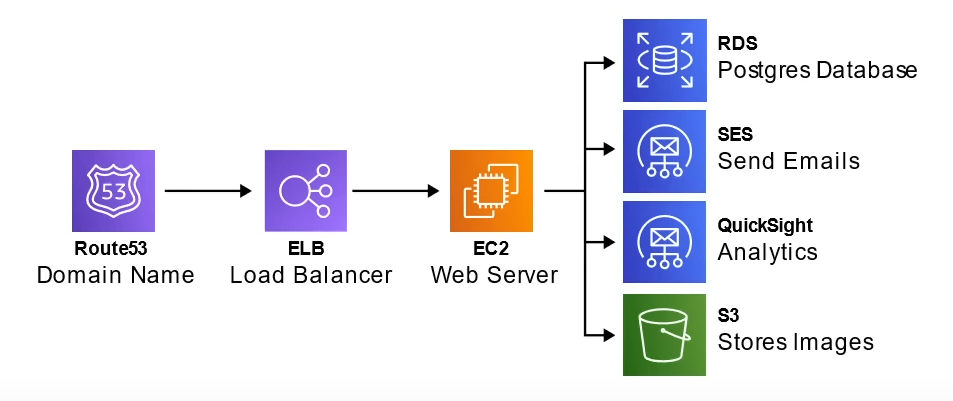
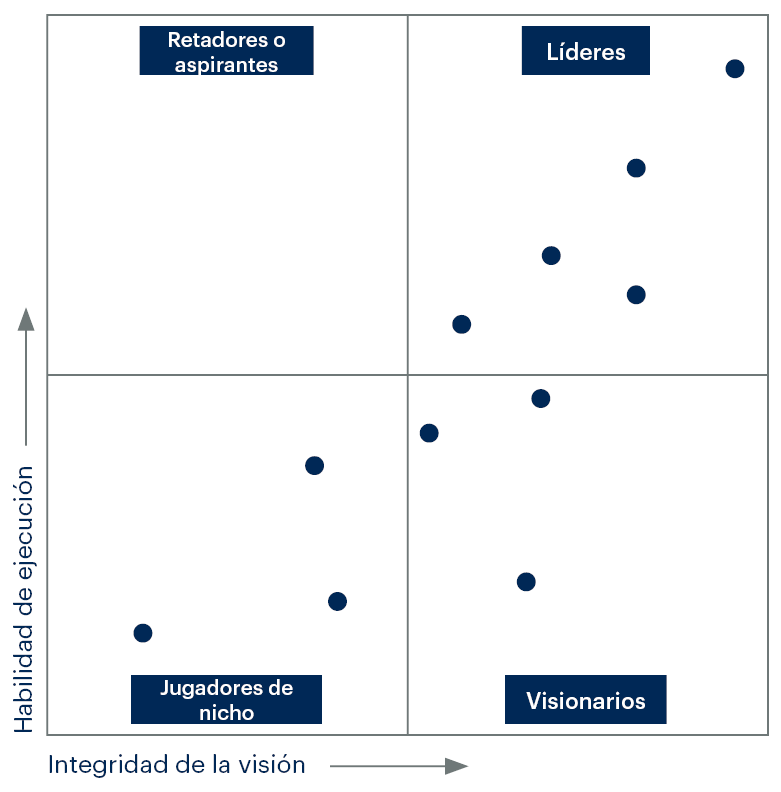
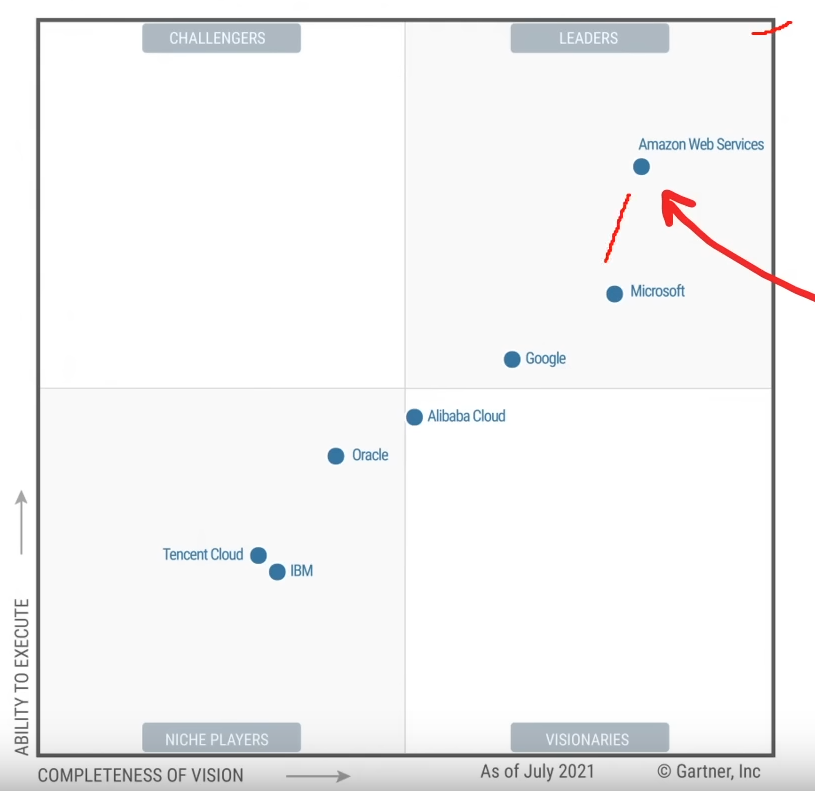
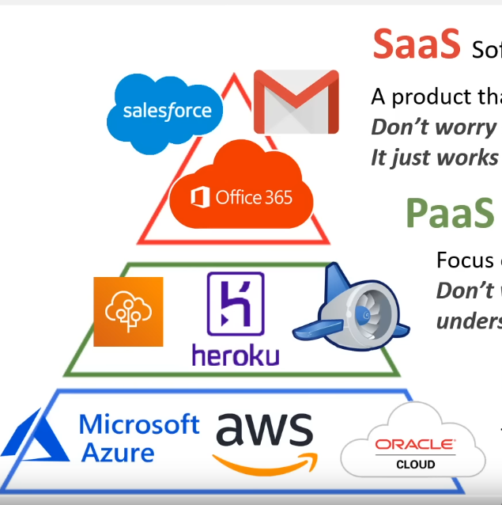
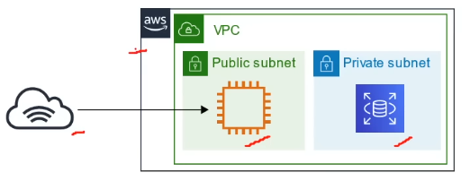
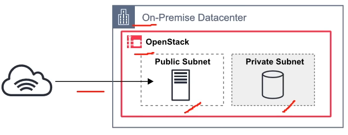
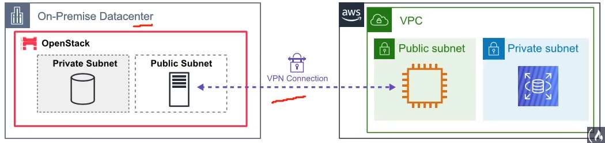
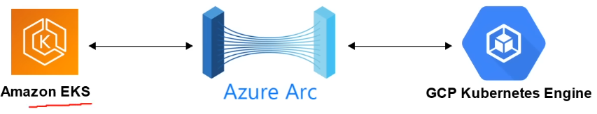
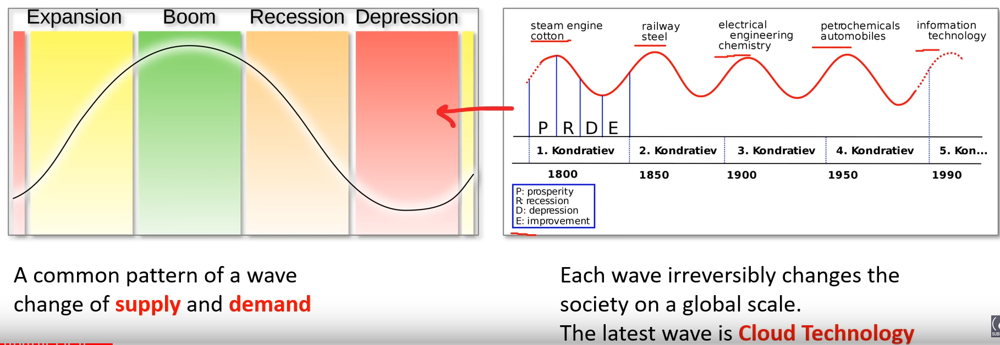

# Notas AWS Cloud Practitioner

## NOTAS GENERALES DEL EXAMEN E INTRODUCCIÓN

- Son 65 preguntas en el examen
- El examen dura 90 minutos
- La puntuación es de 100 a 1,000
- Se necesita un 700 para pasar, equivalente a 47 aciertos
- Se aconseja estudiar de 1 a 2 horas durante 14 días

El objetivo de la certificación es de tener una vista general de conceptos de la nube, costos, seguridad y tecnologías, una vista amplia de todo lo que puede ofrecer AWS. Sirve como punto de partida para la gran mayoría de personas que quieran empezar en Cloud Services.

—

El examen se divide en 4 secciones:

- 26% Cloud concepts
- 25% Security and compliance (**COMPLIANCE ES CUMPLIMIENTO, CONFORMIDAD U OBEDIENCIA**)
- 33% Technology
- 16% Billing and pricing

—

## CLOUD CONCEPTS

### What is Cloud Computing?

Se define como usar servidores remotos para almacenar, manejar y procesar datos, en lugar de usar un servidor local o tu propia computadora.

**Premisa**
- Tú eres dueño del server
- Tú contratas a tus ingenieros de IT
- Tú pagas por las cosas físicas como el internet, electricidad, lugar, etc
- Dependen de tí todos los riesgos

**Proveedores de Cloud**
- Alguien más es dueño del server
- Alguien más contrata a sus ingenieros de IT
- Alguien más paga por todo lo físico
- Tú solo te preocupas por configurar tus servicios de cloud, hacer tu código y el resto es problema del proveedor

—

### Evolution of Cloud Hosting

- **DEDICATED SERVER** 1995, servidor dedicado, una sola compu para un solo negocio y que corres solo una página. MUY CARO, MUCHO MANTENIMIENTO Y ALTA SEGURIDAD.
- **VIRTUAL PRIVATE SERVER (VPS)** Una sola compu dedicada a un solo negocio pero se utiliza para hacer varias máquinas virtuales que van a encargarse de correr varias páginas o sitios. MEJOR UTILIZACIÓN Y AISLAMIENTO DE RECURSOS.
- **SHARED HOSTING**, Una sola compu, compartida por montones de negocios en la que varios utilizan sus recursos. MUY BARATA, MUY LIMITADA Y POCO AISLAMIENTO DE RECURSOS.
- **CLOUD HOSTING**, Varias computadoras unidas como una sola, el sistema se abstrae para dar varios servicios en la nube. ES FLEXIBLE, ESCALABLE, SEGURO, EFECTIVO EN COSTOS Y CON ALTA CONFIGURABILIDAD.

—

### What is Amazon?

Una compañía americana multinacional con sede en Seattle, Washington fimdada em 1994 por Jeff Bezos iniciando como una compañía en línea para venta de libros que posteriormente se expandió a la venta de productos.
Amazon se ha expandido a la nube, e-commerce, servicios de streaming, satélites y tiendas físicas de comida
Andy Jazzy es el nuevo CEO

—

### What is AWS?

Referencia a Amazon Web Services, así es como le llama Amazon a sus servicios en la nube.
En sí es una colección de un chingo de servicios en la nube que se comportan entre ellos de forma uniforme para funcionar bien.
Se fundó en el 2006.

**CSP**: Cloud Service Provider - Proveedor de Servicios en la Nube

- Simple Queue Service (SQS): El primer servicio de AWS, se lanzó en 2004
- Simple Storage Service (S3): se lanzó en marzo de 2006
- Elastic Compute Cloud (EC2): se lanzó en agosto de 2006, es el servicio más usado de AWS, es la columna vertebral de casi cualquier proyecto en AWS

En noviembre de 2010 todos los sitios de Amazon.com se migraron a AWS.
En abril de 2013, amazon empezó a ofrecer una certificación

—

### What is a Cloud Service Provider (CSP)?

- Es una empresa que provee de varios Cloud Services, decenas de cientos de servicios
- Estos **servicios se concatenan** para crear arquitecturas de cloud
- Estos servicios de cloud, son **accessibles a través de una sola API Unificada** por ejemplo la AWS API, puedes acceder a la consola, SDK, etc
- Estos servicios tienen unos **costos bien medidos** basados en su uso, por ejemplo por segundo, por hora, memoria, etc
- Estos servicios se monitorean muy chido mediante herramientas ya incluidas, por ejemplo AWS CloudTrail
- Estos servicios tienen y ofrecen una **Infrastructure as a Service (IaaS)**
- Estos servicios ofrecen **automatización** mediante una **Infrastructure as Code (IaC)**

Ejemplo de una arquitectura de una web app:

La idea de este ejemplo es enseñar como se relacionan los servicios entre sí.

**IMPORTANTE**: Si alguna compañía te ofrece varios cloud services bajo una misma interfaz de usuario pero NO CUMPLE CON LOS REQUERIMIENTOS ANTES LISTADOS, se puede referir a ella como una Cloud Platform, por ejemplo Twilio, HashiCorp o Databricks

—

### Landscape of CSPs (panorama/paisaje de proveedores de cloud)

> Tier 1 (Top tier) - las primeras del mercado, ofrecen bastantes cosas, fuertes sinergias entre servicios y muy reconocidas entre la industria
- AWS - La reina indiscutible
- Microsoft Azure
- Google Cloud Platform (GPC)
*Estas 3 se conocen como las Big 3*
- Alibaba Cloud (se usa muchísimo en China)

> Tier 2 (Mid tier) - respaldadas por compañías de tecnología bien conocidas, lentas en innovación y enfocadas a la especialización
- IBM Cloud
- Oracle Cloud
- Rackspace (OpenStack) - para hacer tus propia cloud

> Tier 3 (Light tier) - son Virtual Private Servers (VPS) servidores viruales privados convertidos para ofrecer Infraestructura como Servicio (IaaS). Son simples y eficientes en costo, están en bastante crecimiento
- Vultr
- Digital Ocean
- Linode

—

### Gartner Magic Quadrant for Cloud (cuadrante mágico de Gartner)

**Magic Quadrant (MQ)**
Es una serie de investigaciones de mercado publicados por la consultora de TI Gartner que depende de métodos de análisis de datos propietarios cualitativos para demostrar tendencias de mercados, como una dirección, madurez y participantes. 
Ejemplo de un MQ

Basado en la información del capítulo anterior, el MQ de CSPs se ve algo así:

Como podemos ver AWS está como lider, mientras más cerca estés de la esquina superior derecha, eres mejor según el mercado.

—

### Common Cloud Services

Un CSP puede tener cientos de servicios, que se agrupan en varios tipos, **los 4 tipos más comúnes de cloud services (the 4 core) para una Infrastructure as a Service (IaaS)** serían:

- Compute: imagínate una computadora que corre programas, aplicaciones, código, etc
- Networking: imagina tener una red virtual, en la que tú defines las conexiones a internet, que conexiones se aislan entre servicios o cuáles salen a internet
- Storage: tener un disco duro virtual imaginario donde puedes almacenar archivos
- Databases: imagina tener una base de datos virtual, para almacenar datos de tus reportes o para un uso general de una web-application

*AWS tiene más de 200 cloud services*

Por lo regular en la industria se generalizan las 4 categorías como "cloud computing"

—

## AWS Technology Overview

Los CSPs que son IaaS siempre te van a ofrecer un ==4 core cloud service==, por ejemplo con AWS:

- Compute: EC2 Vritual Machines
- Storage: EBS Virtual Hard Drives
- Database: RDS SQL Databases
- Networking: VPC Private Cloud Network

Pese a eso te pueden ofrecer categorías con servicios adicionales como:

- Analytics
- Application integration
- AR & VR
- AWS Cost Management
- Blockchain
- Business Applications
- Containers
- Customer Engagement
- Developer Tools
- End User Computing
- Game Tech
- Internet of Things
- Machine Learning
- Management and Governance
- Media Services
- Migration & Transfer
- Mobile
- Quantum Technologies
- Robotics
- Satellites
- Security, Identity & Compliance

Y muchas más que cuesta listar

— 

### AWS Services Preview

Si te metes a [AWS](aws.amazon.com), y le das click en la esquina superior derecha en "Products" encontrarás listados por categorías todos los Servicios de Cloud que tienen que ofrecer.

Apartado de Overview, explica rasgos generales del servicio
Features, información de qué incluye
Pricing, se suele frecuentar mucho para conocer los costes

**Consejo**: ir hasta la parte de abajo y entrar a **documentation** para saber como moverle al service

Se pueden explorar los servicios también mediante la consola

—

### Evolution of Computing

El CSP ofrece todas opciones y debes escoger la que más te conviene

1. **Dedicated**:
    - Un servidor utilizado por **único cliente** tambien nombrado **single tenant**, tienes todo el control de la virtualización.
    - Tienes que calcular la capacidad del servidor para no tenerlo siempre al 100%.
    - Vas a pagar más por la parte del server que no utilices.
    - No tienes forma de hacer una migración o escala, tienes que hacerlo todo manual.
    - Reemplazar el servidor es muy difícil por todas las implicaciones de instalación y configuración.
    - Estás limitado al OS que te ponga el Host.
    - Varias apps podrían dar conflictos cuando se compartan recursos.
    - Se garantiza completamente tu *seguridad, privacidad y utilidad de tus recursos*.
    - El CSP se encarga de proveerte de una máquina segura.
 
 2. **VMs**
     - Puedes tener varias VMs en una sola máquina.
     - ==Hypervisor== es la capa de software que te deja correr las VMs.
     - Un server físico se comparte entre **varios clientes**.
     - Solo pagas una fraccion del servidor
     - Vas a pagar de más por la parte de la VM que no utilices
     - Estás limitado al OS que te den
     - Varias apps podrían dar conflictos cuando se compartan recursos.
     - Es fácil exportar imágenes del sistema cuando se haga una migración.
     - Es muy fácil de escalar horizontal y verticalmente.
     - Es la alternativa más popular y utilizada.
 
 3. **Containers**
     - Una VM puede correr varios containers.
     - Se comportan y manejan de manera similar a las VMs, la capa que deja correr los containers se llama ==Docker Deamon==:
     - Puedes maximizar el uso de la capacidad disponible, lo que es más eficiente en costos. Es flexible para estar cambiando su tamaño.
     - Los containers operan bajo el mismo OS de modo que son más eficientes que tener varias VMs.
     - Varias apps se pueden correr juntas sin limitaciones por el OS y no tener problema cuando se compartan recursos.
     - Son más eficientes pero requieren más trabajo para mantenerlos.
 
 4. **Functions**
     - Las functions van un paso más allá y son todavía más difíciles de mantener que los containers.
     - Son VMs administradas que corren Containers administrados.
     - Son conocidas como **Serverless Compute**.
     - La manera de usarlas es que tú subes tu código y escoges el tiempo y cuánta memoria se va a utilizar (recursos).
     - Tu únicamente te encargas de hacer tu código y calcular los recursos que va a usar.
     - MUY eficiente en costos, porque solo pagas cuando el código corre, las VMs solo funcionan cuando dicho código está corriendo.
     - Una desventaja es que hace un "arranque en frío", de modo que puede ser un poco lenta en ejecutar lo que le estás pidiendo.
     - Se está volviendo muy popular y mucha gente lo está comenzando a utilizar.
 
—
 
### Types of cloud computing

La mejor forma de verlo es como una pirámide dividida en tres secciones:

En la punta está el **SaaS** Software as a Service
- Un producto que corre y maneja el proveedor de servicios. *No te tienes que preocupar sobre cómo mantienen el servicio, simplemente funciona y está siempre disponible*.
- Algunos ejemplos son SalesForce, Gmail y Office 365.
- Por lo regular está diseñado para los Clientes/Usuarios.

En la segunda parte de la pirámide está el **PaaS** Platform as a Service
- Se enfoca en el deploy y manejo de tus apps. *No te tienes que preocupar de provisionar, configurar o entender el hardware o el OS, tú solo te ocupas de mandar y correr las apps*.
- Algunos ejemplos de ello son ElasticBeans, Heroku o Google App Engine.
- Está diseñado principalmente para Desarrolladores.

En la parte más baja de la pirámide está el **IaaS** Infrastructure as a Service
- Contiene las bases para el Cloud IT. Provee de acceso para características de red, cómputo y espacio de almacenamiento. *No te tienes que preocupar acerca de tu gente de IT, servidores y centros de datos y el hardware*.
- Algunos ejemplos de ello son MS Azure, AWS y Oracle Cloud.
- Está diseñado principalmente para administradores.

—

### Cloud Computing Deployment Models

**Public Cloud**
- **Todo** (la carga de trabajo o el proyecto) están dentro del CSP.
- También se conoce como: Cloud-Native o Cloud First
- Diagrama de ejemplo en el que se muestra un proyecto dentro de AWS y sus servicios:

**Private Cloud**
- Todo está dentro del datacenter de la empresa
- También se conoce como **On-Premise** debido a que el datacenter está en la ubicación física de tu chamba
- La Cloud usada suele ser **OpenStack**
- Este es un ejemplo en el que una empresa usa OpenStack para tener sus servicios de Cloud

**Hybrid**
- Usa tanto **On-Premise** como un **Cloud Service Provider**
- Aquí un ejemplo de una empresa compartiendo recursos con la nube mediante alguna conexión, regularmente una VPN

**Cross Cloud**
- Usar **varios CSP** aka "Multi-cloud"
- Aquí un ejemplo de AWS, Azure y GCP integrándose 

- **Anthos** es GCP ofreciendo un panel de control para varios CSP y On-Premise environments

—

### Deployment mode

Son los modos que siguen usando las empresas para hacer deploy

—

### AWS Free Tier

Principio de la cuenta, te permite experimentar los primeros meses con AWS por un par de limitaciones para usar las áreas en las que estés interesados.

Para checar que sigas usando una cuenta en Free Tier, te vas a Billing, Billing Dashboard y debe aparecer una opción para activar las billing alarms

**Hacer Alarmas de costos**

CloudWatch. Alarms. Billing y puedes crear una alarma para que CloudWatch te mande un mensaje si detecta las condiciones de costo que le pongas.

### Innovation waves

Kondratiev waves (aka Innovation waves or K-waves) are hypothesized cycle like phenomena in the global world economy. Escenarios y ciclos hipotéticos de lo que podría pasar con la economía mundial. Es un fenómeno altamente relacionado con los ciclos de vida de la tecnología. Este es un gráfico que lo explica mejor con eventos históricos:

### Burning Platform

Término utilizado cuando una organización abandona la tecnología vieja por tecnología nueva debido a la poca certeza de éxito y puede ser impulsada por el miedo de que el futuro de la organización dependa de su transformación digital.
*Tienes que saltar de la plataforma para salvarte*
*Burning platform hace referencia a una plataforma petrolera en llamas*

### Digital Transformation Checklist

Lista de acciones a tomar para convencer a los altos mandos de las acciones que se deben tomar para una transformación digital exitosa y las razones de ello.

### Evolution of computing power

**What is computing power?**
El medio para medir en que una computadora puede completar una tarea computacional.

**AWS Service Offering**

Elastic Compute Cloud (EC2)
AWS creó el AWS Inferentiare para el GPU Computing
AWS Bracket Via CalTech

### Amazon Braket

Es para cloud computing

—

### Scaling Amazon EC2

Escalabilidad y Flexibilidad, cómo puedes hacer que la capacidad de tus centros de datos se adapten a tus necesidades basado en tus horas o periodos de tiempo de uso.
Las empresas que contratan o usan On-Demand no tienen forma de adaptar su capacidad al uso, debido a que siempre están págando por el 100% del hardware, aún cuando muchas veces no usen ni el 10% de todo su poder.
AWS permite utilizar los recursos para mantener el servicio activo, corriendo y adaptable sin puntos de falla.
Amazon EC2 tiene una función llamada **EC2 Auto Scaling** para satisfacer esa necesidad.

Within Amazon EC2 Auto Scaling, you can use two approaches: dynamic scaling and predictive scaling.

* _Dynamic scaling_ responds to changing demand. 
* _Predictive scaling _automatically schedules the right number of Amazon EC2 instances based on predicted demand.

**Tipos de escalabilidad**

- Vertical or scale up: meterle más recursos a la máquina que está corriendo el servicio. (Por sentido común sería lo óptimo, pero la mejor forma de verlo es imaginar una cafetería, con un cajero muy chingón pero que tiene que atender a un cliente bien wey teniendo una fila enorme de clientes esperando).
- Horizontal: añadir más computadoras para atender la carga de trabajo. Deja de ser óptimo cuando hay pocos clientes.

La ventaja que ofrece AWS es que permite tener el número correcto de instancias en el momento que los necesitas, de modo que las utilices del modo más eficiente.

**Concepto del Auto Scaling Group de EC2**

Puedes crear tu Auto Scaling Group, en el que estableces un mínimo, un deseado, y una capacidad máxima de instancias de EC2 que van a correr de acuerdo a la demanda de usuarios.
El mínimo son las instancias que van a iniciar nadamás encender el auto scaling group.
El desired van a correr en cuanto se superen las capacidades del minimo.
Y maximo solo durante picos de demanda.

### Directing Traffic with Elastic Load Balancing

Volvemos al ejemplo de la cafetería, supongamos que la gente está pendeja y todos se van a ser atendidos con el mismo cajero, dejando a los demás sin hacer nada. El problema es resuelto poniendo a alguien en la entrada a que cuente cuántas personas está atendiendo cada cajero para que los reparta de modo que sea eficiente.

A esto se le conoce en computación como un Load Balancer, debido a que todas las instancias deberían de ser capaces de correr lo mismo con la misma eficiencia. AWS ofrece varias soluciones para ello.

Tener un tráfico adecuado permite tener alto rendimiento, mayor eficiencia de costos, alta disponibilidad y escalamiento auitomático.

**Elastic Load Blancing** ELB, es uno de los que vamos a aprender. 
Regional construct, corre a nivel región, de modo que siempre está disponible. 
Es escalable, aumenta su capacidad conforme al número de demanda de usuarios.
ELB permite solicitar más y menos instancias de acuerdo a la demanda.
Funciona como un "puente" entre el frontend y el backend, en el que manda de forma ordenada las solicitudes al backend, y se entera de las capacidades del backend para distribuir mejor el tráfico de red. ESTO EVITA QUE CUANDO UNA INSTANCIA NUEVA SE ENCIENDA, NO SE TENGA QUE MANDAR ESA INFORMACIÓN AL FRONTEND, SOLAMENTE EL LOAD BALANCER SE ENTERA. El front end solamente se encarga de mandar solicitudes, no le importa quién las procese,
